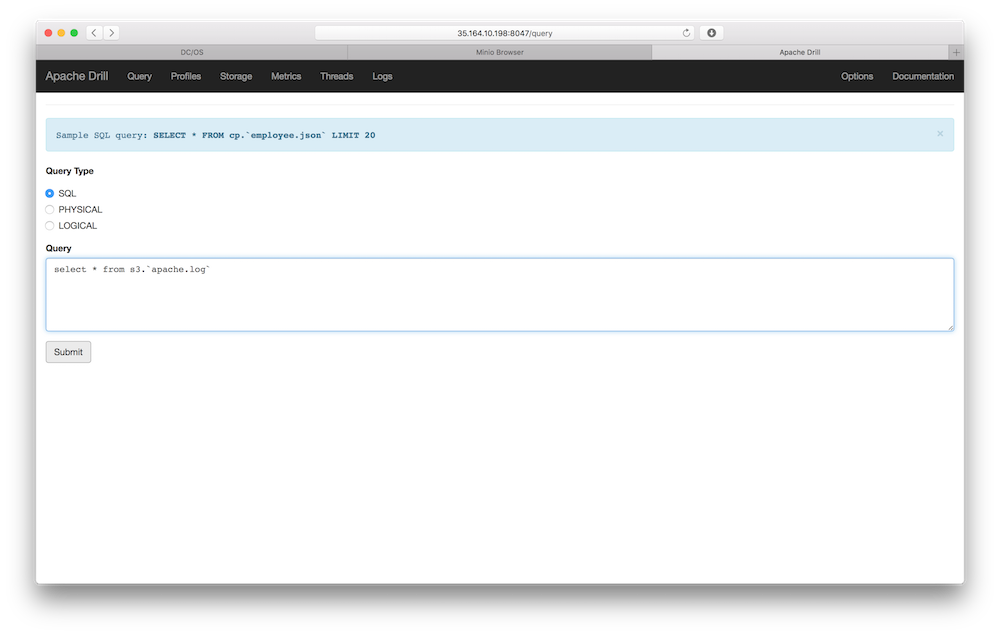

# Fast Data: Application Logs

TBD

- Estimated time for completion:
 - Install: 20min
 - Development: unbounded
- Target audience: Anyone interested in online log analysis.

**Table of Contents**:

- [Architecture](#architecture)
- [Prerequisites](#prerequisites)
- [Install](#install) the demo
- [Use](#use) the demo
- [Development and testing](#development)

## Architecture

TBD


## Prerequisites

- A running [DC/OS 1.8.7](https://dcos.io/releases/1.8.7/) or higher cluster with at least 3 private agents and 1 public agent each with 2 CPUs and 5 GB of RAM available as well as the [DC/OS CLI](https://dcos.io/docs/1.8/usage/cli/install/) installed in version 0.14 or higher.
- The [dcos/demo](https://github.com/dcos/demos/) Git repo must be available locally, use: `git clone https://github.com/dcos/demos.git` if you haven't done so, yet.
- The JSON query util [jq](https://github.com/stedolan/jq/wiki/Installation) must be installed.
- [SSH](https://dcos.io/docs/1.8/administration/access-node/sshcluster/) cluster access must be set up.

Going forward we'll call the directory you cloned the `dcos/demo` Git repo into `$DEMO_HOME`.

## Install

### Marathon-LB

For Minio and Apache Drill we need to have Marathon-LB installed:

```bash
$ dcos package install marathon-lb
```

### Minio

To serve the log data for analysis in Drill we use Minio in this demo, just as you would use, say, S3 in AWS.

To set up Minio find out the [IP of the public agent](https://dcos.io/docs/1.8/administration/locate-public-agent/)
and store it in an environment variable called `$PUBLIC_AGENT_IP`, for example:

```bash
$ export PUBLIC_AGENT_IP=34.250.247.12
```

Now you can install the Minio package like so:

```bash
$ cd $DEMO_HOME/1.8/sensoranalytics/
$ sed -i '.tmp' "s/PUBLIC_AGENT_IP/$PUBLIC_AGENT_IP/" ./minio-config.json
$ dcos package install minio --options=minio-config.json
$ mv ./minio-config.json.tmp ./minio-config.json
```

After this, Minio is available on port 80 of the public agent, so open `$PUBLIC_AGENT_IP`
in your browser and you should see the UI.

Next, we will need to get the Minio credentials in order to access the Web UI (and later on the HTTP API).
The credentials used by Minio are akin to the ones you might know from Amazon S3, called `$ACCESS_KEY_ID`
and `$SECRET_ACCESS_KEY`. In order to obtain these credentials, go to the `Services` tab of the DC/OS UI and
select the running Minio service; click on the `Logs` tab and you should see:


Note that you can learn more about Minio and the credentials in the respective [example](https://github.com/dcos/examples/tree/master/1.8/minio#using-browser-console).

TBD: create test bucket and upload test data `apache.log`.

### Apache Drill

A prerequisite for the Drill install to work is that three environment variables
are defined: `$PUBLIC_AGENT_IP` (the public agent IP address), as well as `$ACCESS_KEY_ID`
and `$SECRET_ACCESS_KEY` (Minio credentials); all of which are explained in the
previous section. I've been using the following (specific for my setup):

```bash
$ export PUBLIC_AGENT_IP=34.250.247.12
$ export ACCESS_KEY_ID=F3QE89J9WPSC49CMKCCG
$ export SECRET_ACCESS_KEY=2/parG/rllluCLMgHeJggJfY9Pje4Go8VqOWEqI9
```

Now do the following to install Drill:

```bash
$ cd $DEMO_HOME/1.8/applogs/
$ sed -i '.tmp' "s,_PUBLIC_AGENT_IP,$PUBLIC_AGENT_IP,g; s,_ACCESS_KEY_ID,$ACCESS_KEY_ID,; s,_SECRET_ACCESS_KEY,$SECRET_ACCESS_KEY," ./drill/apache-drill.json
$ dcos package marathon app add ./drill/apache-drill.json
$ mv ./drill/apache-drill.json.tmp ./drill/apache-drill.json
```

Got to `http://$PUBLIC_AGENT_IP:8047/` to access the Drill Web UI:



Use `drill/drill-s3-plugin-config.json` to configure the S3 storage plugin.

Execute the following query to check if all is working:

```sql
select * from s3.`apache.log`
```

### Wordpress

Note that the environment variable called `$PUBLIC_AGENT_IP` must be exported.

```bash
$ cd $DEMO_HOME/1.8/applogs/
$ dcos package install mysql --options=mysql-config.json
$ sed -i '.tmp' "s/_PUBLIC_AGENT_IP/$PUBLIC_AGENT_IP/" wp-config.json
$ dcos package install wordpress --options=wp-config.json
$ mv wp-config.json.tmp wp-config.json
```

Discover where WP is available via HAProxy `http://$PUBLIC_AGENT_IP:9090/haproxy?stats`:

## Use

The following sections describe how to use the demo after having installed it.

Plan: load tester, run sync job, use Drill to understand usage.

## Discussion

Should you have any questions or suggestions concerning the demo, please raise an [issue](https://dcosjira.atlassian.net/) in Jira or let us know via the [users@dcos.io](mailto:users@dcos.io) mailing list.
