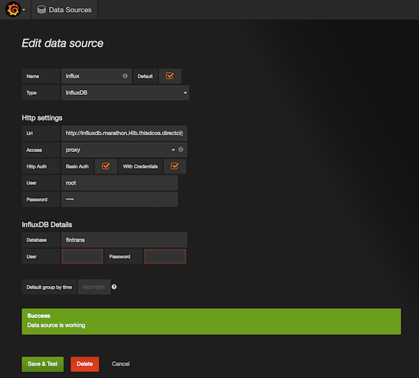
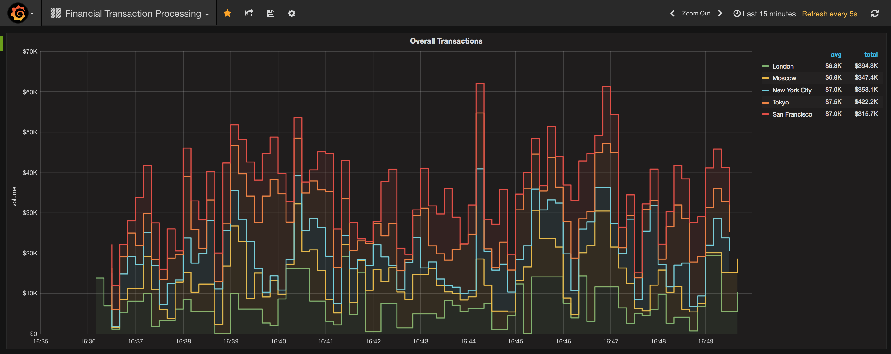

# Fast Data: Financial Transaction Processing

This demo is all about processing, monitoring and understanding high-volume financial transactions. There are several challenges that we tackle here: 1. the frequency of transaction, 2. the volume of transaction, 3. scaling. 

For the sake of this demo let's assume you're responsible for building a data processing infrastructure that allows insights about recent transactions from multiple locations (with recent being, for example, the past hour) as well as being able to spot fraudulent transactions, for example such that violate money laundering regulations. In the context of money laundering, what happens is that a large amount, say $1,000,000 is split into many small batches, each just under the allowed value of, for example, $10,000. With many tens or hundreds thousands of transactions going on at any given point in time it's hard to keep a running total for each account in real time and react appropriately. Failure to report or react on attempted money laundering typically means fines for the financial institutions—something best avoided altogether. See also [US](https://www.fincen.gov/history-anti-money-laundering-laws) and [EU](http://eur-lex.europa.eu/legal-content/EN/TXT/?uri=CELEX%3A32015L0849) legislation and regulations on this topic for more information.

- Estimated time for completion: 
 - Fast track: 15min
 - Manual: 45min
 - Development: unbounded
- Target audience: Anyone interested stream data processing and analytics with Apache Kafka.

**Table of Contents**:

- [Prerequisites](#prerequisites)
- Install the demo:
 - [Single command](#single-command)
 - [Manual](#manual)
- [Use](#use) the demo
 - [Generating transactions](#generating-transactions)
 - [Consuming transactions](#consuming-transactions)
- [Development and testing](#development)

## Prerequisites

- A running [DC/OS 1.8.7](https://dcos.io/releases/1.8.7/) or higher cluster with at least 2 private agents each with 2 CPUs and 5 GB of RAM available.
- [DC/OS CLI](https://dcos.io/docs/1.8/usage/cli/install/) installed in version 0.14 or above
- The [dcos/demo](https://github.com/dcos/demos/) Git repo must be available locally, use: `git clone https://github.com/dcos/demos.git` if you haven't done so, yet.

Going forward we'll call the directory you cloned the `dcos/demo` Git repo into `$DEMO_HOME`.

The DC/OS services and support libraries used in the demo are as follows:

- Apache Kafka 0.10.0 with Shopify's [sarama](https://godoc.org/github.com/Shopify/sarama) package, client-side.
- InfluxDB 0.13.0 with [influxdata v2](https://github.com/influxdata/influxdb/tree/master/client/v2) package, client-side.
- Grafana v3.1.1

## Install
### Single command

If you want to install the demo with a single command, use:

```bash
$ cd $DEMO_HOME
$ ./install-all.sh
```

Now you can jump to ...

### Manual

If you want to install the demo manually here are the required services that you'd need to set up.

#### InfluxDB

Install InfluxDB with the following [options](influx-ingest/influx-config.json):

```bash
$ cd $DEMO_HOME/1.8/fintrans/influx-ingest/
$ dcos package install --options=influx-config.json influxdb
```

#### Grafana

Install Marathon-LB and Grafana (the latter uses the former to be accessible from outside the cluster):

```bash
$ dcos package install marathon-lb
$ dcos package install grafana

```

The Grafana dashboard is available on `$PUBLIC_AGENT_IP:13000`, and if you don't know `$PUBLIC_AGENT_IP` yet, [find it out first](https://dcos.io/docs/1.8/administration/locate-public-agent/). Log in with: `admin`/`admin`.

Next, we set up a datasource, connecting Grafana to InfluxDB. Use `http://influxdb.marathon.l4lb.thisdcos.directory:8086` as the URL under `Http settings` with `root`/`root` as credential and `fintrans` as the value for `Database` under `InfluxDB Details`. The result should look as follows:



#### Kafka

[Install](https://github.com/dcos/examples/tree/master/1.8/kafka) the Apache Kafka package with the following [options](kafka-config.json):

```bash
$ cd $DEMO_HOME/1.8/fintrans/
$ dcos package install kafka --options=kafka-config.json
```

Next, figure out where the broker is:

```bash
$ dcos kafka connection

{
  "address": [
    "10.0.3.178:9398"
  ],
  "zookeeper": "master.mesos:2181/dcos-service-kafka",
  "dns": [
    "broker-0.kafka.mesos:9398"
  ],
  "vip": "broker.kafka.l4lb.thisdcos.directory:9092"
}
```

Note the FQDN for the broker, in our case `broker-0.kafka.mesos:9398`, you will need it if you want to do local [development and testing](#development)

## Use
### Generating transactions

The first step necessary is to produce financial transactions. The format used to represent a transaction is as follows:

```
source_account target_account amount
```

For example, `396 465 6789` means that $6789 have been transferred from account no `396` to `465`.

It's the job of the fintrans generator to produce (random) transactions; the generator itself is stateless and ingests the transactions in Kafka, organized by city. That is, the city the transaction originated in is represented by a Kafka topic. The five cities used are:

    London
    NYC
    SF
    Moscow
    Tokyo

Now, for a local dev/test setup (and with the VPN tunnel enabled) we can run the fintrans generator as follows:

```bash
$ cd $DEMO_HOME/1.8/fintrans/generator/
$ go build
$ ./generator --broker broker-0.kafka.mesos:9398
INFO[0001] &sarama.ProducerMessage{Topic:"London", Key:sarama.Encoder(nil), Value:"678 816 2957", Metadata:interface {}(nil), Offset:10, Partition:0, Timestamp:time.Time{sec:0, nsec:0, loc:(*time.Location)(nil)}, retries:0, flags:0}
INFO[0003] &sarama.ProducerMessage{Topic:"SF", Key:sarama.Encoder(nil), Value:"762 543 6395", Metadata:interface {}(nil), Offset:4, Partition:0, Timestamp:time.Time{sec:0, nsec:0, loc:(*time.Location)(nil)}, retries:0, flags:0}
INFO[0005] &sarama.ProducerMessage{Topic:"London", Key:sarama.Encoder(nil), Value:"680 840 8115", Metadata:interface {}(nil), Offset:11, Partition:0, Timestamp:time.Time{sec:0, nsec:0, loc:(*time.Location)(nil)}, retries:0, flags:0}
INFO[0007] &sarama.ProducerMessage{Topic:"SF", Key:sarama.Encoder(nil), Value:"363 101 9878", Metadata:interface {}(nil), Offset:5, Partition:0, Timestamp:time.Time{sec:0, nsec:0, loc:(*time.Location)(nil)}, retries:0, flags:0}
INFO[0009] &sarama.ProducerMessage{Topic:"SF", Key:sarama.Encoder(nil), Value:"302 505 5777", Metadata:interface {}(nil), Offset:6, Partition:0, Timestamp:time.Time{sec:0, nsec:0, loc:(*time.Location)(nil)}, retries:0, flags:0}
INFO[0011] &sarama.ProducerMessage{Topic:"London", Key:sarama.Encoder(nil), Value:"848 948 2683", Metadata:interface {}(nil), Offset:12, Partition:0, Timestamp:time.Time{sec:0, nsec:0, loc:(*time.Location)(nil)}, retries:0, flags:0}
INFO[0013] &sarama.ProducerMessage{Topic:"NYC", Key:sarama.Encoder(nil), Value:"611 695 5484", Metadata:interface {}(nil), Offset:9, Partition:0, Timestamp:time.Time{sec:0, nsec:0, loc:(*time.Location)(nil)}, retries:0, flags:0}
INFO[0015] &sarama.ProducerMessage{Topic:"NYC", Key:sarama.Encoder(nil), Value:"396 465 6789", Metadata:interface {}(nil), Offset:10, Partition:0, Timestamp:time.Time{sec:0, nsec:0, loc:(*time.Location)(nil)}, retries:0, flags:0}
INFO[0018] &sarama.ProducerMessage{Topic:"Moscow", Key:sarama.Encoder(nil), Value:"132 570 3197", Metadata:interface {}(nil), Offset:9, Partition:0, Timestamp:time.Time{sec:0, nsec:0, loc:(*time.Location)(nil)}, retries:0, flags:0}
INFO[0020] &sarama.ProducerMessage{Topic:"NYC", Key:sarama.Encoder(nil), Value:"607 672 9732", Metadata:interface {}(nil), Offset:11, Partition:0, Timestamp:time.Time{sec:0, nsec:0, loc:(*time.Location)(nil)}, retries:0, flags:0}
^C
```

Note that if you want to reset the topics, that is remove all messages for a certain topic (= city) stored in Kafka, you can do a `dcos kafka topic list` and `dcos kafka topic delete XXX` with `XXX` being one of the listed topics (cities).

### Consuming transactions

#### Real-time transaction volume dashboard

One consumer of the transactions we stored in Kafka above is the InfluxDB ingestion process. It uses Grafana as the visual frontend, showing a breakdown of average and total transaction volume per city. 

Again, assuming VPN tunnel is enabled, you need to find out the InfluxDB API URL and provide it via an environment variable `INFLUX_API` (note that this is only for local development necessary, not in prod):

```bash
$ cd $DEMO_HOME/1.8/fintrans/influx-ingest/
$ go build
$ INFLUX_API=http://10.0.3.178:11973 ./influx-ingest --broker broker-0.kafka.mesos:9398
INFO[0003] Got main.Transaction{City:"Tokyo", Source:"836", Target:"378", Amount:1211}  func=consume
INFO[0003] Connected to &client.client{url:url.URL{Scheme:"http", Opaque:"", User:(*url.Userinfo)(nil), Host:"10.0.3.178:11973", Path:"", RawPath:"", RawQuery:"", Fragment:""}, username:"root", password:"root", useragent:"InfluxDBClient", httpClient:(*http.Client)(0xc82000bb30), transport:(*http.Transport)(0xc8200d00c0)}  func=consume
INFO[0003] Preparing batch &client.batchpoints{points:[]*client.Point(nil), database:"fintrans", precision:"s", retentionPolicy:"", writeConsistency:""}  func=consume
INFO[0003] Added point &client.Point{pt:(*models.point)(0xc8200839e0)}  func=consume
INFO[0003] Ingested &client.batchpoints{points:[]*client.Point{(*client.Point)(0xc82000f9f0)}, database:"fintrans", precision:"s", retentionPolicy:"", writeConsistency:""}  func=ingest2Influx
INFO[0005] Got main.Transaction{City:"London", Source:"597", Target:"378", Amount:7394}  func=consume
INFO[0005] Connected to &client.client{url:url.URL{Scheme:"http", Opaque:"", User:(*url.Userinfo)(nil), Host:"10.0.3.178:11973", Path:"", RawPath:"", RawQuery:"", Fragment:""}, username:"root", password:"root", useragent:"InfluxDBClient", httpClient:(*http.Client)(0xc8202c2d20), transport:(*http.Transport)(0xc82021a300)}  func=consume
INFO[0005] Preparing batch &client.batchpoints{points:[]*client.Point(nil), database:"fintrans", precision:"s", retentionPolicy:"", writeConsistency:""}  func=consume
INFO[0005] Added point &client.Point{pt:(*models.point)(0xc820206b40)}  func=consume
INFO[0005] Ingested &client.batchpoints{points:[]*client.Point{(*client.Point)(0xc8200e5010)}, database:"fintrans", precision:"s", retentionPolicy:"", writeConsistency:""}  func=ingest2Influx
```

In Grafana at `$PUBLIC_AGENT_IP:13000`, after loading the [dashboard](influx-ingest/grafana-dashboard.json), you should see something like this:



#### Money laundering detector

Another consumer of the transactions stored in Kafka is the money laundering detector. It is a command line tool only that alerts when the aggregate transaction volume from a certain source to a target account hits a certain (configurable) treshold. 

Now, in order to highlight potential money laundering attempts to a human operator who then has to verify manually if there indeed fraudulent transactions have been taken place, you can launch the detector as follows:

```bash
$ cd $DEMO_HOME/1.8/fintrans/laundering-detector/
$ go build
$ ALERT_THRESHOLD=6000 ./laundering-detector --broker broker-0.kafka.mesos:9398
INFO[0002] Queued main.Transaction{City:"SF", Source:"970", Target:"477", Amount:1102}  func=consume
INFO[0002] Dequeued main.Transaction{City:"SF", Source:"970", Target:"477", Amount:1102}  func=detect
INFO[0002] 970 -> 477 totalling 1102 now                 func=detect
INFO[0002] Current queue length: 0                       func=detect
INFO[0004] Queued main.Transaction{City:"London", Source:"236", Target:"367", Amount:9128}  func=consume
INFO[0004] Dequeued main.Transaction{City:"London", Source:"236", Target:"367", Amount:9128}  func=detect
INFO[0004] 236 -> 367 totalling 9128 now                 func=detect
POTENTIAL MONEY LAUNDERING: 236 -> 367 totalling 9128 now
INFO[0004] Current queue length: 0                       func=detect
INFO[0006] Queued main.Transaction{City:"London", Source:"603", Target:"634", Amount:5012}  func=consume
INFO[0006] Dequeued main.Transaction{City:"London", Source:"603", Target:"634", Amount:5012}  func=detect
INFO[0006] 603 -> 634 totalling 5012 now                 func=detect
INFO[0006] Current queue length: 0                       func=detect
^C
``` 

Note that if you're only interested in the money laundering alerts you can execute it as follows, effectively hiding all the `INFO` messages:

```bash
$ ALERT_THRESHOLD=6000 ./laundering-detector --broker broker-0.kafka.mesos:9398 2>/dev/null
POTENTIAL MONEY LAUNDERING: 292 -> 693 totalling 7104 now
POTENTIAL MONEY LAUNDERING: 314 -> 666 totalling 6613 now
^C
```

## Development

For local development and testing we use [DC/OS tunneling](https://dcos.io/docs/1.8/administration/access-node/tunnel/) to make the nodes directly accessible on the development machine:

```bash
$ sudo dcos tunnel vpn --client=/Applications/Tunnelblick.app/Contents/Resources/openvpn/openvpn-2.3.12/openvpn
Password:
*** Unknown ssh-rsa host key for 35.156.70.254: 13ec7cde1d3967d2371eb375f48c4690

ATTENTION: IF DNS DOESN'T WORK, add these DNS servers!
198.51.100.1
198.51.100.2
198.51.100.3

Waiting for VPN server in container 'openvpn-6nps1efm' to come up...

VPN server output at /tmp/tmpn34d7n0d
VPN client output at /tmp/tmpw6aq3v4z
```

Note that it may be necessary to [add the announced DNS servers]( https://support.apple.com/kb/PH18499?locale=en_US) as told by Tunnelblick, and make sure they are the first in the list.
