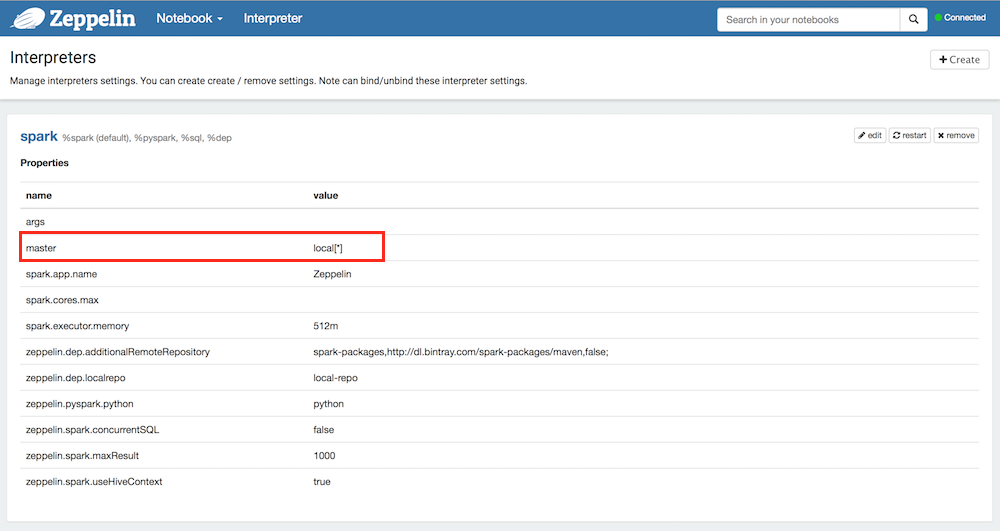

# Fast Data: Sensor Analytics

This demo is all about gaining insights from sensor streaming data.


- Estimated time for completion:
 - Single command: 10min
 - Manual: 25min
 - Development: unbounded
- Target audience: Anyone interested stream data processing and analytics with Apache Spark.

**Table of Contents**:

- [Architecture](#architecture)
- [Prerequisites](#prerequisites)
- Install the demo:
 - [Single command](#single-command)
 - [Manual](#manual)
- [Use](#use) the demo
 - [Generating transactions](#generating-transactions)
 - [Consuming transactions](#consuming-transactions)
- [Development and testing](#development)

## Architecture

## Prerequisites

- A running [DC/OS 1.8.7](https://dcos.io/releases/1.8.7/) or higher cluster with at least 4 private agents and 1 public agent each with 2 CPUs and 5 GB of RAM available as well as the [DC/OS CLI](https://dcos.io/docs/1.8/usage/cli/install/) installed in version 0.14 or higher.
- The [dcos/demo](https://github.com/dcos/demos/) Git repo must be available locally, use: `git clone https://github.com/dcos/demos.git` if you haven't done so, yet.
- The JSON query util [jq](https://github.com/stedolan/jq/wiki/Installation) must be installed.
- [SSH](https://dcos.io/docs/1.8/administration/access-node/sshcluster/) cluster access must be set up.

Going forward we'll call the directory you cloned the `dcos/demo` Git repo into `$DEMO_HOME`.

The DC/OS services and support libraries used in the demo are as follows:

- TBD

We're using the Open Data Aarhus [real-time traffic  data](https://www.odaa.dk/dataset/realtids-trafikdata) kindly provided by the Aarhus Kommune (Denmark, Europe), available via the CC Open Data license. Open Data rocks!

An [exemplary snapshot](example_data.json) is available here in this repo. This snapshot was created using the following command:

```bash
$ curl -o example_data.json https://www.odaa.dk/api/action/datastore_search?resource_id=b3eeb0ff-c8a8-4824-99d6-e0a3747c8b0d&limit=5
```

Note that the data source is updated roughly every 5 min, something to be taken into account when showing the demo.

## Install

TBD

### Single command

TBD

### Manual

#### Kafka

Install the Apache Kafka package with the following [options](kafka-config.json):

```bash
$ cd $DEMO_HOME/1.8/sensoranalytics/
$ dcos package install kafka --options=kafka-config.json
```

Note that if you are unfamiliar with Kafka and its terminology, you can check out the respective [101 example](https://github.com/dcos/examples/tree/master/1.8/kafka) as well now.

Next, figure out where the broker is:

```bash
$ dcos kafka connection

{
  "address": [
    "10.0.3.178:9398"
  ],
  "zookeeper": "master.mesos:2181/dcos-service-kafka",
  "dns": [
    "broker-0.kafka.mesos:9398"
  ],
  "vip": "broker.kafka.l4lb.thisdcos.directory:9092"
}
```

Note the FQDN for the broker, in our case `broker-0.kafka.mesos:9398`.

### Spark

Since the current Universe version of Apache Spark (2.0.2) is incompatible with the
current Universe version of Apache Zeppelin (0.5.6-incubating) you'd need to re-configure
Zeppelin's [Spark Interpreter](http://zeppelin.apache.org/docs/0.5.6-incubating/interpreter/spark.html)
as described in the next section.

If you want to use a newer version of Zeppelin that supports Spark 2.x then you
can proceed here.

Install the Apache Spark package:

```bash
$ dcos package install spark
Installing Marathon app for package [spark] version [1.0.6-2.0.2]
Installing CLI subcommand for package [spark] version [1.0.6-2.0.2]
New command available: dcos spark
DC/OS Spark is being installed!

        Documentation: https://docs.mesosphere.com/current/usage/service-guides/spark/
        Issues: https://docs.mesosphere.com/support/
```

### Zeppelin

Install the Apache Zeppelin package:

```bash
$ dcos package install zeppelin
Installing Marathon app for package [zeppelin] version [0.5.6]
DC/OS Zeppelin is being installed!

        Documentation: https://docs.mesosphere.com/zeppelin/
        Issues: https://docs.mesosphere.com/support/
```

Change the [Spark Interpreter](http://zeppelin.apache.org/docs/0.5.6-incubating/interpreter/spark.html)
to use `local[*]`, that is, the build-in Spark engine:



Next, set up [dependencies](https://spark.apache.org/docs/latest/streaming-kafka-0-10-integration.html#linking)
for Spark Streaming + Kafka support:

```bash
%dep
z.load("org.apache.spark:spark-streaming-kafka_2.11:1.6.3")
```

## Use

The following sections describe how to use the demo after having installed it.

TBD

## Development

If you are interested in testing this demo locally or want to extend it, follow the instructions in this section.


### Tunneling

For local development and testing we use [DC/OS tunneling](https://dcos.io/docs/1.8/administration/access-node/tunnel/) to make the nodes directly accessible on the development machine. The following instructions are only an example (using Tunnelblick on macOS) and the concrete steps necessary depend on your platform as well as on what VPN client you're using.

```bash
$ sudo dcos tunnel vpn --client=/Applications/Tunnelblick.app/Contents/Resources/openvpn/openvpn-2.3.12/openvpn
```

Note that it is necessary to [add the announced DNS servers]( https://support.apple.com/kb/PH18499?locale=en_US) as told by Tunnelblick, and make sure the are they appear at the top of the list, before any other DNS server entries.

### Traffic data fetcher

For a local dev/test setup, and with [DC/OS VPN tunnel](#tunneling) enabled, we can run the traffic data fetcher as follows:

```bash
$ cd $DEMO_HOME/1.8/sensoranalytics/traffic-fetcher/
$ go build
$ ./traffic-fetcher -broker broker-0.kafka.mesos:9233
INFO[0002] &sarama.ProducerMessage{Topic:"trafficdata", Key:sarama.Encoder(nil), Value:"{\"result\":{\"fields\":[{\"type\":\"int4\",\"id\":\"_id\"},{\"type\":\"int4\",\"id\":\"REPORT_ID\"},{\"type\":\"timestamp\",\"id\":\"TIMESTAMP\"},{\"type\":\"text\",\"id\":\"status\"},{\"type\":\"int4\",\"id\":\"avgMeasuredTime\"},{\"type\":\"int4\",\"id\":\"medianMeasuredTime\"},{\"type\":\"int4\",\"id\":\"vehicleCount\"},{\"type\":\"int4\",\"id\":\"avgSpeed\"}],\"records\":[{\"status\":\"OK\",\"avgMeasuredTime\":104,\"TIMESTAMP\":\"2017-01-13T11:50:00\",\"medianMeasuredTime\":104,\"avgSpeed\":19,\"vehicleCount\":9,\"_id\":418,\"REPORT_ID\":204273},{\"status\":\"OK\",\"avgMeasuredTime\":59,\"TIMESTAMP\":\"2017-01-13T11:50:00\",\"medianMeasuredTime\":59,\"avgSpeed\":35,\"vehicleCount\":6,\"_id\":53,\"REPORT_ID\":187748},{\"status\":\"OK\",\"avgMeasuredTime\":138,\"TIMESTAMP\":\"2017-01-13T11:50:00\",\"medianMeasuredTime\":138,\"avgSpeed\":30,\"vehicleCount\":11,\"_id\":228,\"REPORT_ID\":183091},{\"status\":\"OK\",\"avgMeasuredTime\":69,\"TIMESTAMP\":\"2017-01-13T11:54:00\",\"medianMeasuredTime\":69,\"avgSpeed\":48,\"vehicleCount\":8,\"_id\":330,\"REPORT_ID\":181331},{\"status\":\"OK\",\"avgMeasuredTime\":120,\"TIMESTAMP\":\"2017-01-13T11:55:00\",\"medianMeasuredTime\":120,\"avgSpeed\":61,\"vehicleCount\":5,\"_id\":338,\"REPORT_ID\":197951},{\"status\":\"OK\",\"avgMeasuredTime\":145,\"TIMESTAMP\":\"2017-01-13T11:55:00\",\"medianMeasuredTime\":145,\"avgSpeed\":51,\"vehicleCount\":3,\"_id\":345,\"REPORT_ID\":158505},{\"status\":\"OK\",\"avgMeasuredTime\":57,\"TIMESTAMP\":\"2017-01-13T11:55:00\",\"medianMeasuredTime\":57,\"avgSpeed\":70,\"vehicleCount\":6,\"_id\":395,\"REPORT_ID\":197463},{\"status\":\"OK\",\"avgMeasuredTime\":78,\"TIMESTAMP\":\"2016-10-05T09:29:00\",\"medianMeasuredTime\":78,\"avgSpeed\":67,\"vehicleCount\":17,\"_id\":450,\"REPORT_ID\":1164},{\"status\":\"OK\",\"avgMeasuredTime\":44,\"TIMESTAMP\":\"2017-01-13T11:50:00\",\"medianMeasuredTime\":44,\"avgSpeed\":39,\"vehicleCount\":20,\"_id\":381,\"REPORT_ID\":183009},{\"status\":\"OK\",\"avgMeasuredTime\":188,\"TIMESTAMP\":\"2017-01-13T11:50:00\",\"medianMeasuredTime\":188,\"avgSpeed\":15,\"vehicleCount\":2,\"_id\":49,\"REPORT_ID\":187509}]}}\n", Metadata:interface {}(nil), Offset:8, Partition:0, Timestamp:time.Time{sec:0, nsec:0, loc:(*time.Location)(nil)}, retries:0, flags:0}
```

To check if the messages arrive in the `trafficdata` topic in Kafka, you can, for example, ssh into the Master and then do the following there (see also the [DC/OS Kafka example](https://github.com/dcos/examples/tree/master/1.8/kafka#consume-a-message) if you're unsure about what's happening here):

```bash
core@ip-10-0-5-169 ~ $ docker run -it mesosphere/kafka-client
root@a773778c0962:/bin# ./kafka-console-consumer.sh --zookeeper leader.mesos:2181/dcos-service-kafka --topic trafficdata --from-beginning
{"result":{"fields":[{"type":"int4","id":"_id"},{"type":"int4","id":"REPORT_ID"},{"type":"timestamp","id":"TIMESTAMP"},{"type":"text","id":"status"},{"type":"int4","id":"avgMeasuredTime"},{"type":"int4","id":"medianMeasuredTime"},{"type":"int4","id":"vehicleCount"},{"type":"int4","id":"avgSpeed"}],"records":[{"status":"OK","avgMeasuredTime":104,"TIMESTAMP":"2017-01-13T11:50:00","medianMeasuredTime":104,"avgSpeed":19,"vehicleCount":9,"_id":418,"REPORT_ID":204273},{"status":"OK","avgMeasuredTime":59,"TIMESTAMP":"2017-01-13T11:50:00","medianMeasuredTime":59,"avgSpeed":35,"vehicleCount":6,"_id":53,"REPORT_ID":187748},{"status":"OK","avgMeasuredTime":138,"TIMESTAMP":"2017-01-13T11:50:00","medianMeasuredTime":138,"avgSpeed":30,"vehicleCount":11,"_id":228,"REPORT_ID":183091},{"status":"OK","avgMeasuredTime":69,"TIMESTAMP":"2017-01-13T11:54:00","medianMeasuredTime":69,"avgSpeed":48,"vehicleCount":8,"_id":330,"REPORT_ID":181331},{"status":"OK","avgMeasuredTime":120,"TIMESTAMP":"2017-01-13T11:55:00","medianMeasuredTime":120,"avgSpeed":61,"vehicleCount":5,"_id":338,"REPORT_ID":197951},{"status":"OK","avgMeasuredTime":145,"TIMESTAMP":"2017-01-13T11:55:00","medianMeasuredTime":145,"avgSpeed":51,"vehicleCount":3,"_id":345,"REPORT_ID":158505},{"status":"OK","avgMeasuredTime":57,"TIMESTAMP":"2017-01-13T11:55:00","medianMeasuredTime":57,"avgSpeed":70,"vehicleCount":6,"_id":395,"REPORT_ID":197463},{"status":"OK","avgMeasuredTime":78,"TIMESTAMP":"2016-10-05T09:29:00","medianMeasuredTime":78,"avgSpeed":67,"vehicleCount":17,"_id":450,"REPORT_ID":1164},{"status":"OK","avgMeasuredTime":44,"TIMESTAMP":"2017-01-13T11:50:00","medianMeasuredTime":44,"avgSpeed":39,"vehicleCount":20,"_id":381,"REPORT_ID":183009},{"status":"OK","avgMeasuredTime":188,"TIMESTAMP":"2017-01-13T11:50:00","medianMeasuredTime":188,"avgSpeed":15,"vehicleCount":2,"_id":49,"REPORT_ID":187509}]}}
```


### Spark stream processing

- using [integration](https://spark.apache.org/docs/latest/streaming-kafka-0-10-integration.html) to read out from Spark
- Spark streaming job to pull out data, aggregate it and using Zeppelin as the front-end to visualize it


## Discussion

Should you have any questions or suggestions concerning the demo, please raise an [issue](https://dcosjira.atlassian.net/) in Jira or let us know via the [users@dcos.io](mailto:users@dcos.io) mailing list.
