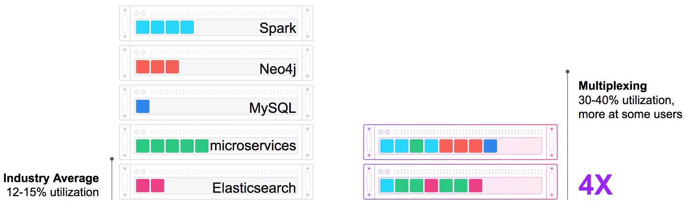
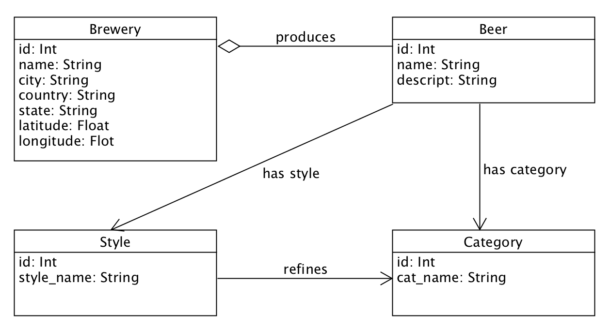

# The DC/OS beer demo


Are you wondering how [Java](http://www.oracle.com/technetwork/java/index.html), [Spring Boot](https://projects.spring.io/spring-boot/), [MySQL](https://www.mysql.com), [Neo4j](https://neo4j.com), [Apache Zeppelin](https://zeppelin.apache.org/), [Apache Spark](https://spark.apache.org/), [Elasticsearch](https://www.elastic.co), [Docker](https://www.docker.com), [Apache Mesos](https://mesos.apache.org/) and [DC/OS](https://dcos.io) can all fit in one demo? Well, we'll show you! This is a rather complex demo, so grab your favorite beer and enjoy. 🍺 Check out [this fork](https://github.com/rimusz/dcos-k8s-beer-demo) for Kubernetes integration.

## General problems of current data center layouts
Most current data centers are architectured to be statically partitioned. This means that you have different subclusters for each part of your system. Let's say your data center has 30 nodes. You would typically slice these 30 nodes into smaller parts and assign applications to dedicated nodes. This has a couple of disadvantages. You need to optimize each subcluster against load peaks and, if nodes crash during those peaks, you are not able to shift applications to other nodes dynamically. On top of that, you're using resources inefficiently.

Resource utilization in typical industry clusters show average CPU utilization around 15% with this classic approach. Would'nt it be cool to be able to shift applications dynamically between nodes, be more flexible against failure and load peaks, and save money?



In this demo, we will increase cluster utilization by operating the Java service architecture together with all data applications on the same DC/OS cluster. Running all those different kind of application on the same cluster brings a couple of advantages. Your cluster has one big pool of resources and you are able to start applications on free resources everywhere in the cluster.

- In case of failure, your application will be dynamically restarted somewhere else in the cluster.
- Different applications usually have load peaks at different times of the day and they nicely complement each other. If you don’t partition this pool statically, you don’t need to optimize each part individually and reserve more resource than you need.

## Operating data applications in a containerized world
Orchestrating stateless applications in a containerized world is fairly simple. If you need to scale up or down, you just start or stop applications. If an application terminates, you can just restart it somewhere else. But what about operating data applications, like a traditional database or a distributed one? I would bet that you care about your data and where a replacement application is started for example.

In general, there are three different kinds of applications.


1. Stateless applications, like `nginx`, `spring boot` or `node` applications. They usually don't hold business-relevant data, so we usually don't care where replacement applications are scheduled or if we get the data back if an application crashes. For sure, this kind of applications produces logs, but we will take care of those separately. In Mesos, you can configure a default sandbox for those applications. You can use local disk, but, if the container crashes, this data is gone.

2. Stateful applications, traditional databases without cluster support, for example `MySQL`. They hold business-relevant data and we usually care a lot about what happens to this data if an application crashes. Because these applications don't support replication on their own, you must use backups and external storage to save data. If you really want to have a smooth fail-over strategy, you would usually pick an external storage option for those kind of tasks. This option has poor performance for write requests, but survives node failures. In Mesos, you can consume external storage, such as Amazon EBS.

3. But what if you are operating a database that was designed for distributed systems, like `Elasticsearch`, `Cassandra`, or similar data stores? They hold business-relevant data and provide a replication layer within the database. It would wasteful to use a distributed storage layer if the application is able to solve this problem on its own. In Mesos, you can use local persistent volumes. With this feature, it is possible to label a dedicated space on the local disk and, if the application terminates, the replacement application can be re-scheduled to the exact same data again. It doesn't matter if the application crashed because of an error, or if this was a planned maintenance or update. The already-used data can be re-used and the application can decide if it wants to re-use the data and only replicate the last few minutes or if a full replication is needed.

## Demo on youtube
If you are totally new to [DC/OS](https://dcos.io/) or container orchestration in general, I would recommend you to visit our website and check the [documentation](https://dcos.io/docs/1.10/) section.

If you don't want to read documentation and a more entertaining (Monkey Island™) introduction, I am inviting you to watch this youbube video 👇❤️

[](https://www.youtube.com/watch?v=u2mpN2GxfVY)


## The domain
In this demo, we are talking all about beer. The old website [openbeerdb.com](https://openbeerdb.com) offers an outdated list of beer, breweries, beer categories, and beer styles as downloadable sql files. But age doesn't matter for this demo, as long as you are old enough to drink.

You can find the sql files and the related readme in the `database/sql` folder. This database contains a list of around 1500 breweries and 6000 different beers with their relation to category and style. You can see the model and important properties in the diagram below:



## Overview
Ok, now you know the domain: Let's talk about our story! 

1. In this demo we want to build a simple Spring Boot service first that offers us a random beer of the day via HTTP API. You can find a spring boot web application in the `service` folder. We see all the application lifecycle steps her,e from deploy over scale to break, update and recover.
2. After we successfully implement our service using the openbeerdb data, we want to do more analysis with the Neo4j graph database. You can find the data migration implementation in the `neo4j-migration` folder.
3. Using the power of a graph database, we can do fancy queries like `List all styles of beers produced in a certain place and show many breweries produce it there` without the hassle of complicated joins.
4. After we do complex analysis in a graph database, we want to do mass analysis using a Map/Reduce job in Spark. You can find a Zeppelin notepad in the file `zeppelin-analysis.json` containing a Map/Reduce job to count all the words in beer descriptions to give an overview of what words are used in a beer description.
5. Last but not least, we will see how to use Elasticsearch to back our service architecture with a centralized logging system.

## 0. Docker
We are using Docker in this demo to package most parts of our system. This is important because we want to run exactly the same code in development, stage, and production. We just want to change the environment-specific configuration for each of those stages.
You can find the Docker files in the `database` and `service` folders. Both images are rather simple, starting with an official base image of `mysql` or `java` and just adding the initial sql files or the application jar file.

Our Docker Compose configuration looks like this:

```
version: '2'
services:
  database:
    image: unterstein/dcos-beer-database:latest

  service:
    image: unterstein/dcos-beer-service:latest
    ports:
      - "8080:8080"
    depends_on:
      - database
      - logstash
    environment:
      - SERVICE_VERSION=2
      - SPRING_DATASOURCE_URL=jdbc:mysql://database:3306/beer?user=good&password=beer
      - LOGSTASH_DESTINATION=logstash:5000

  elasticsearch:
    image: elasticsearch:5.5.2
    volumes:
      - /usr/share/elasticsearch/data
    ports:
      - "9200:9200"
    environment:
      ES_JAVA_OPTS: "-Xmx256m -Xms256m"

  logstash:
    image: logstash:5.5.2
    environment:
      LS_JAVA_OPTS: "-Xmx256m -Xms256m"
    command: "-e 'input { tcp { port => 5000 } } output { elasticsearch { hosts => \"http://elasticsearch:9200\" } }'"
    depends_on:
      - elasticsearch

  kibana:
    image: kibana:5.5.2
    ports:
      - "5601:5601"
    environment:
      - ELASTICSEARCH_URL=http://elasticsearch:9200

```

You can see a database without configuration in the first section. In the second section, you can see the configured Java service. The service depends on the database and has environment-specific configuration for its version and the database connectivity. The ELK stack is also configured.

## 1. The Spring Boot service
This service basically has three endpoints.

1. `GET /` delivers the beer of the day.
2. `GET /application/health` will respond with a `HTTP 200` as long as the internal state indicates a healthy system. This endpoint will return a `HTTP 500` otherwise. The service is healthy by default.
3. `DELETE /health`. You can switch the internal state of the service to unhealthy by calling this endpoint.

If you point your browser to `$dockerIp:8080`, you will get the following answer:

```
{
    "hostAddress": "172.23.0.3",
    "version": "2",
    "beerName": "Wicked Ale",
    "beerStyle": "American-Style Brown Ale",
    "beerDescription": "Pete's Wicked Ale is an experience out of the ordinary. Our tantalizing ruby-brown ale with distinctive malts and aromatic Brewers Gold hops is sure to stir up an urge to get loose."
}
```

You find the properties `hostAddress` and `version`, which are for demoing purposes. We will see them later when using DC/OS to scale and update our application. When we scale out our service, we will see load balanced responses, and when we update our application, we will see rolling upgrades.

You'll also find the name of our beer of the day, the style of the beer, and a description. This beer description sounds really tasty!

### 1.1 DC/OS application definition
**Note:** In order to deploy all parts of this demo successfully, I would recomment so spin up a cluster with at least 7 private DC/OS nodes.

Similar to a Docker Compose file, you can find a marathon group definition in the `marathon-configuration.json` file.

```
{
   "id":"/beer",
   "apps":[
      {
         "id":"/beer/database",
         "cpus":1,
         "mem":1024,
         "instances":1,
         "container":{
            "type":"DOCKER",
            "docker":{
               "image":"unterstein/dcos-beer-database",
               "network":"BRIDGE",
               "portMappings":[
                  {
                     "hostPort":0,
                     "containerPort":3306,
                     "protocol":"tcp",
                     "labels":{
                        "VIP_0":"database:3306",
                        "VIP_1":"3.3.0.6:3306"
                     }
                  }
               ]
            }
         },
         "healthChecks":[
            {
               "protocol":"TCP",
               "portIndex":0,
               "gracePeriodSeconds":300,
               "intervalSeconds":60,
               "timeoutSeconds":20,
               "maxConsecutiveFailures":3,
               "ignoreHttp1xx":false
            }
         ]
      },
      {
         "id":"/beer/service",
         "dependencies":[
            "/beer/database",
            "/beer/logstash"
         ],
         "cpus":1,
         "mem":2024,
         "instances":2,
         "healthChecks":[
            {
               "protocol":"HTTP",
               "path":"/application/health",
               "portIndex":0,
               "timeoutSeconds":10,
               "gracePeriodSeconds":60,
               "intervalSeconds":2,
               "maxConsecutiveFailures":10
            }
         ],
         "container":{
            "type":"DOCKER",
            "docker":{
               "image":"unterstein/dcos-beer-service",
               "network":"BRIDGE",
               "portMappings":[
                  {
                     "hostPort":0,
                     "containerPort":8080,
                     "protocol":"tcp"
                  }
               ]
            }
         },
         "env":{
            "VERSION":"3",
            "SPRING_DATASOURCE_URL":"jdbc:mysql://database.marathon.l4lb.thisdcos.directory:3306/beer?user=good&password=beer",
            "LOGSTASH_DESTINATION":"logstash.marathon.l4lb.thisdcos.directory:5000",
            "ELASTICSEARCH_URL":"http://elasticsearch.marathon.l4lb.thisdcos.directory:9200"
         },
         "upgradeStrategy":{
            "minimumHealthCapacity":0.85,
            "maximumOverCapacity":0.15
         },
         "labels":{
            "HAPROXY_0_PORT":"80",
            "HAPROXY_GROUP":"external"
         }
      },
      {
         "id":"/beer/logstash",
         "dependencies":[
            "/beer/elasticsearch"
         ],
         "cpus":1.5,
         "mem":512,
         "instances":1,
         "healthChecks":[
            {
               "protocol":"TCP",
               "portIndex":0,
               "timeoutSeconds":10,
               "gracePeriodSeconds":90,
               "intervalSeconds":2,
               "maxConsecutiveFailures":10
            }
         ],
         "container":{
            "type":"DOCKER",
            "docker":{
               "image":"logstash:5.5.2",
               "network":"BRIDGE",
               "portMappings":[
                  {
                     "hostPort":0,
                     "containerPort":5000,
                     "protocol":"tcp",
                     "labels":{
                        "VIP_0":"logstash:5000"
                     }
                  }
               ]
            }
         },
         "cmd":"/docker-entrypoint.sh -e 'input { tcp { port => 5000 codec => json } } output { elasticsearch { hosts => \"http://elasticsearch.marathon.l4lb.thisdcos.directory:9200\" } }'"
      },
      {
         "id":"/beer/elasticsearch",
         "cpus":2,
         "mem":4096,
         "instances":1,
         "healthChecks":[
            {
               "protocol":"HTTP",
               "path":"/",
               "portIndex":0,
               "timeoutSeconds":10,
               "gracePeriodSeconds":30,
               "intervalSeconds":2,
               "maxConsecutiveFailures":10
            }
         ],
         "container":{
            "type":"DOCKER",
            "docker":{
               "image":"elasticsearch:5.5.2",
               "network":"BRIDGE",
               "portMappings":[
                  {
                     "hostPort":0,
                     "containerPort":9200,
                     "protocol":"tcp",
                     "labels":{
                        "VIP_0":"elasticsearch:9200"
                     }
                  },
                  {
                     "hostPort":0,
                     "containerPort":9300,
                     "protocol":"tcp",
                     "labels":{
                        "VIP_0":"elasticsearch:9300"
                     }
                  }
               ]
            },
            "volumes": [
               {
                 "containerPath":"esdata",
                 "mode":"RW",
                 "persistent": {
                   "type":"root",
                   "size":5000
                 }
               },
               {
                 "containerPath": "/usr/share/elasticsearch/data",
                 "hostPath": "esdata",
                 "mode": "RW"
               }
            ]
         },
         "env":{
            "ES_JAVA_OPTS":"-Xmx3072m -Xms3072m"
         },
         "unreachableStrategy": {
            "inactiveAfterSeconds": 300,
            "expungeAfterSeconds": 600
         }
      },
      {
         "id":"/beer/kibana",
         "dependencies":[
            "/beer/elasticsearch"
         ],
         "cpus":0.5,
         "mem":512,
         "instances":1,
         "healthChecks":[
            {
               "protocol":"HTTP",
               "path":"/",
               "portIndex":0,
               "timeoutSeconds":10,
               "gracePeriodSeconds":10,
               "intervalSeconds":2,
               "maxConsecutiveFailures":10
            }
         ],
         "container":{
            "type":"DOCKER",
            "docker":{
               "image":"kibana:5.5.2",
               "network":"BRIDGE",
               "portMappings":[
                  {
                     "hostPort":0,
                     "containerPort":5601,
                     "protocol":"tcp"
                  }
               ]
            }
         },
         "env":{
            "ELASTICSEARCH_URL":"http://elasticsearch.marathon.l4lb.thisdcos.directory:9200"
         },
         "labels":{
            "HAPROXY_0_PORT":"5601",
            "HAPROXY_GROUP":"external"
         }
      }
   ]
}
```

This above definition is a little bit more verbose than the docker compose file, but we are configuring more options here.

#### Spring Boot and MySQL
Each application has an identifier followed by resource limitations. Our database application is allowed to consume 1 CPU and 1GB of memory.

We want to start one database instance and we want to use the same Docker images again as we used for Docker Compose. But now we need to configure a network option because we are dealing with a real distributed system and not a local sandbox. In this example, you see two [virtual IP](https://docs.mesosphere.com/1.10/networking/load-balancing-vips/) configurations. One with a name-based pattern and one with an IP-based pattern. With this configuration, all traffic on this name-port combination is routed to our database application.

Our Java application has a dependency to the database, so it is deployed after the database is marked as healthy. This service also has resource limitations, but we want to start two instances of this service. We also have a health check configured for the Java service.

The health check specifies that the `/application/health` endpoint will be checked every 2 seconds after an initial grace period of 10 seconds if it returns a `HTTP 2xx`. If this check fails 10 times in a row, this service will be replaced with another one.

To expose our application to the outside, we need to add a network configuration. Because we added a `labels` section for our HAproxy later in the configuration, we can use a random host port in this section.

To connect this Java service to the database, we need to adjust the environment variables. In this example we are using the name-based VIP pattern, so we need to use this discovery name: `database.marathon.l4lb.thisdcos.directory`. See the [docs](https://docs.mesosphere.com/1.10/networking/dns-overview/) for more information.

Last but not least, we added configuration for rolling upgrades. During an upgrade, we want a maximum overcapacity of 15% and a minimum health capacity of 85%. Image you have 20 services running. A rolling upgrade would be like, `start 3 new ones, wait for them to become healthy, then stop old ones`. If you don't like rolling upgrades, you can use blue/green or canary upgrades as well. See the [docs](https://docs.mesosphere.com/1.8/usage/service-discovery/load-balancing-vips/) for more information.

#### Elasticsearch, Logstash, Kibana
Ok, let's start with Elasticsearch and the three main new configuration options here. First, elasticsearch exposes two [virtual IPs](https://docs.mesosphere.com/1.10/networking/load-balancing-vips/). `elasticsearch:9200` is used by Logstash, Kibana and the migration. `elasticsearch:9300` is used by the spring boot application to proxy search request.

```
"portMappings":[
  {
     "hostPort":0,
     "containerPort":9200,
     "protocol":"tcp",
     "labels":{
        "VIP_0":"elasticsearch:9200"
     }
  },
  {
     "hostPort":0,
     "containerPort":9300,
     "protocol":"tcp",
     "labels":{
        "VIP_0":"elasticsearch:9300"
     }
  }
]
```


Elasticsearch is a distributed database. As discussed earlier, you don't need distributed storage for a distributed database, because you would waste a lot of performance when you have replication on application layer and on storage layer. But on the other side you don't want to loose all your data, when you restart Elasticsearch. In DC/OS you have the option to use [local persistent volumes](http://mesosphere.github.io/marathon/docs/persistent-volumes.html). They allow you to label space on the local disk. If an instance is shut down, due to failure or maintenance, DC/OS is waiting to see this data again and is able to restart the replication instance on the exact same data again. In best case this prevents Elasticsearch from a full replication and leads to a smaller replication for only the last couple of minutes.

```
"volumes": [
   {
     "containerPath":"esdata",
     "mode":"RW",
     "persistent": {
       "type":"root",
       "size":5000
     }
   },
   {
     "containerPath": "/usr/share/elasticsearch/data",
     "hostPath": "esdata",
     "mode": "RW"
   }
]
```

In a highly distributed system, you eventually lose nodes, applications are unreachable and you are not always sure if your node will come back. Maybe you need your configured amount of Elasticsearch instances always up and running and you tolerate unreachable instances only for a couple of minutes. For this purpose, you can configure an `unreachableStrategy`. With the configuration of the example blow, DC/OS would wait for 5 minutes if an unreachable Elasticsearch instance is detected. After this 5 minutes, DC/OS would start a replacement task. If you are running a proper configured Elasticsearch cluster, you would not experience a downtime, but you give the node some time to come back.

```
"unreachableStrategy": {
    "inactiveAfterSeconds": 300,
    "expungeAfterSeconds": 600
}
```

#### Mesosphere Elasticsearch scheduler
If you want to install a proper production system, you may want to check out the more sophisticated scheduled elasticsearch installation using the [Mesosphere Elasticsearch scheduler](https://github.com/mesosphere/dcos-commons/tree/master/frameworks/elastic). With this scheduler you get custom behavior in case of failure, scaling, updating and many more edge cases. As you can see below, this package requires a little bit more resources than our existing Elasticsearch configuration, therefore we stick to our already deployed version.


 
### 1.2 Deploy our system to DC/OS
If you have the DC/OS CLI installed, you can simply run `dcos marathon group add marathon-configuration.json` to install our group of applications. You can do this via the UI as well.

In order to expose this application to the outside, you will need to install Marathon-LB. Marathon-LB is a dynamic HAproxy that will automatically configure the applications running in Marathon. If you have an application with `HAPROXY` labels, Marathon-LB will route load balanced traffic from the outside to the healthy running instances. You can install Marathon-LB via the UI or via the CLI. Simply run `dcos package install marathon-lb`.

### Check utilization
After installation is finished, we should see cluster utilization as shown below:


This is the first time, we see the DC/OS dashboard in this demo. This dashboard combines the most important facts an operates cares about when he gets paged at 3am. You see an aggregated view on your resources, you see an aggregated view on your cpu, memory and disk allocations. Furthermore you see the amount and health status of your deployed applications and about the health of DC/OS itself. If you would scroll down in the real dashboard, you would see information about the nodes of this cluster. But the fact that this cluster contains 7 agents is just a detail and only relevant if the other numbers are not good.

### 1.3 See it working
Point your browser to your public IP. You will get an answer like this:

```
{
    "hostAddress": "172.17.0.2",
    "version": "3",
    "beerName": "Millennium Lager",
    "beerStyle": "German-Style Pilsener",
    "beerDescription": "A tasy classic pilsner."
}
```

Well, sounds like a decent lager! Germans aren't known for being wordy ;-).

### 1.4 Scale it
Now that we've installed the application, let's scale it. Simply run `dcos marathon update /beer/service instances=20`. This will change the property `instances` to 20 and start a deployment to reach this target instance count. If your cluster does not have enough resources, a scale to 5 is also fine.

### 1.5 Break it
Ok, let's break it! Remember that we talked about health checks and how you can toggle them in our service? Run `curl -XDELETE https://your.public.elb.amazonaws.com/health` to change the health check of one running instance. Navigate to the DC/OS UI to see one unhealthy instance. After around 20 seconds, this unhealthy application will be replaced with a new one. This is why a health check is performed every 2 seconds and we configured 10 maximum consecutive failures.

### 1.6 Update it
Most configuration changes will trigger a new deployment. Usually, you would reconfigure your application to use a new Docker version or change endpoints or something similar. In this example, we will update our environment variable `VERSION`. Simply go to the UI and navigate to the Java service, and then to the environment section. You can change the configuration from 3 to 4 here. When you hit the save button, you will trigger a rolling deployment. If you now repeatedly refresh your browser tab with the beer of the day responses, you will see that sometimes you will get a `"version": "3"` and sometimes a `"version": "4"`.

## 2. Check Elasticsearch for logging synchronization
Even if we are able to deploy and scale dynamically across all cluster nodes, we should gather logs in a centralized place. If you do this, you have one place to search in your logs and you don't need to log in to every single container. Additionally, you will keep your logs even if the container terminates.

Point your browser to your public IP on port 5601 to see a similar search result to the image below:


Depending on the requests you made against the Java beer service, you will see more or fewer log entries in this Kibana search result. Properties like `version`, `uuid`, `log level`, and `host` will be exposed as first class properties and can be selected as a filter. This feature helps you distinguish between log entries of different applications, but also allows you to search all log entries of a certain application in a highly distributed and dynamic system.

Additionally, you could create a visualization to display the data in a pie chart, line chart, or compose those visualizations into a fancy dashboard as shown below:


## 3. Extract rich data to Neo4j
### 3.1 Install Neo4j
To install a proper Neo4j [causal cluster](http://neo4j.com/docs/operations-manual/current/clustering/causal-clustering/), simply run `dcos package install neo4j`. This will install a Neo4j cluster of 3 Neo4j core nodes. If you want to access your Neo4j cluster from outside of your DC/OS cluster, you will also need to install the `neo4j-proxy` package. DC/OS is designed to run applications internally on private nodes by default.

### 3.2 The migration job
In order to migrate the database from MySQL to Neo4j, we need to run a migration. In DC/OS, we can run the migration one time or as scheduled jobs. Simply go to the `neo4j-migration` and run `dcos job add job-configuration.json` and `dcos job run neo4j-migration` to execute it once.


## 4. Query connected data
After the job runs, we can see the result of our enriched and connected data. Point your browser to https://publicIp:7474 and log in to Neo4j with the default credentials `neo4j:dcos`. The graph model looks like this:


The special thing about this graphs is that hops between nodes are native database concepts and way cheaper than joins in relational databases. In Neo4j, you can query patterns of node-relation combination. For example, a query like this `MATCH (brewery: Brewery)-[*1..2]->(style: Style) WHERE brewery.country = "Germany" WITH style, count(*) as c RETURN style, c;` would return all breweries from Germany that has a relation over maximum 2 hops to a style of beer. If you pick one of the resulting nodes and double click to expand relations, you might be lucky and get a result like this:


If you go for a more text-based result, you could run `MATCH (brewery: Brewery)-[:PRODUCES]->(beer: Beer)-[:HAS_STYLE]->(style: Style) WHERE brewery.country = "Germany" WITH style, count(beer) as c ORDER BY c DESC RETURN style.name, c;` and get the following result:


So, we see that Germany likes to produce and probably drink `South German-Style Hefeweizen`. We could re-run this query with `WHERE brewery.country = "United States"`, but well...there is no good american beer anyways ;-).

### Check utilization
After installing Neo4j and running the migration, we should see cluster utilization as shown below:


As you can see, we increased the CPU utilization from 27% to 52% by running our data services together with our Java services.

## 5. Map/Reduce
Imagine we had a huge data set that doesn't fit in memory, but we want to do analysis on this data anyway. Let's use Map/Reduce to solve this issue.

### 5.1 Install Zeppelin
First we need to install Zeppelin. Run `dcos package install zeppelin`. Zeppelin is a web notebook where you can post Scala code to a big text input field. When you hit the compile button, this Scala code will be compiled and executed in a Spark cluster.

### 5.2 Do the analytics
If you go the the DC/OS UI in the Services section of the DC/OS UI and hover over the Zeppelin application, you will see a link to an external application. Follow this link to access the Zeppelin UI. On the left hand side, you will see an option to upload a noteboo;. Upload the `zeppelin-analysis.json` file. When you now open the notebook, you will see a predefined Spark job.


In the first section, you can see our declared dependencies. We want to import SQL data, so we import our MySQL connector.

In the second section, you see the actual job. First we create a connection. This time, we are using IP-based VIP discovery.
Then we are concurrently querying for 5,000 beers, then filtering noise and splitting it into a single sequence of words. Then, we are perform a basic word count algorithm.

In the map phase, we are transforming each single word to a tuple of (word, 1). For example the word `beer` would be transformed to `(beer, 1)`. This can be done in parallel.

In the reduce phase, we are transforming each tuple with the same key to a new tuple, but the sum of the values. For example `(beer, 1)` and `(beer, 1)` would be transformed to `(beer, 2)`. This can also be in parallel.

In the third and last section, you can query the result of the reduce phase with a SQL-like language. In this example we are selecting the words ordered by descending occurrence:


You can see the occurrences of `573 on hops`, `488 on malt`, `428 flavor`. Yummy, these are good words to describe beer! So, if I were a data analyst, I would try to find relations between those frequent words to optimize my own beer description.

### Check utilization
After installing Zeppelin and running our Map/Reduce job, we should see a cluster utilization as shown below:


WOW! We increased the CPU utilization nearly to maximum to run our Spark job and went from initially 7 running tasks to 22. This is great 🎉.

If we want to continue in this demo and run our Elasticsearch migration, we need to give resources back to the cluster and uninstall Zeppelin. But this is no problem, because Mesos is all about using only currently needed resources and give it back afterwards.


## 6. Elasticsearch as full text search
Ok, still not enough data applications for you? Good! I have one more thing for you! We are already using Elasticsearch as a central logging sink. Now, we want to start another migration to synchronize our beer descriptions to Elasticsearch and add full text search to our beer descriptions. Simply go to `elasticsearch-migration` and run `dcos job add job-configuration.json` and `dcos job run elasticsearch-migration` to execute it once.

Point your browser to your public IP on path `/search?q=hops` to see a similar answer:

```
{
   "took":5,
   "timed_out":false,
   "_shards":{
      "total":5,
      "successful":5,
      "skipped":0,
      "failed":0
   },
   "hits":{
      "total":785,
      "max_score":1.8710579,
      "hits":[
         {
            "_index":"beer",
            "_type":"beer",
            "_id":"2360",
            "_score":1.8710579,
            "_source":{
               "name":"Bottle Rocket IPA",
               "description":"An explosion of hops dominate this deep golden ale. Brewed with four varieties of hops & dry hopped with three other hops, the flavor is powerful. Not a harsh bitterness, but a full hop flavor."
            }
         },
         {
            "_index":"beer",
            "_type":"beer",
            "_id":"4412",
            "_score":1.84492,
            "_source":{
               "name":"Rockslide IPA",
               "description":"If being in one of the coldest places in the US isn't extreme enough, the contents of this beer may very well redefine your commitment to the pursuit of hops. Rockslide IPA is brewed in the 'West Coast' style with aggressive amounts of American hops such as Amarillo, Centennial and Summit hops. You are greeted with a full frontal assault of citrus/grapefruit/pine hop character, followed up with malt to balance the mouthfeel. This beer is all about hops."
            }
         },
         ...
      ]
   }
}
```

Our beer application will proxy the search query to Elasticsearch and will return the response.

## Conclusion
Cheers 🍺
