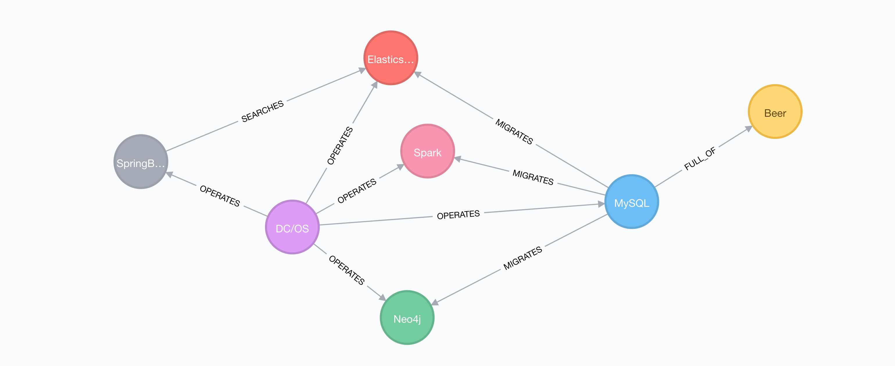

# The DC/OS + Kubernetes + Helm - cool beer demo



Are you wondering how [Java](http://www.oracle.com/technetwork/java/index.html), [Spring Boot](https://projects.spring.io/spring-boot/), [MySQL](https://www.mysql.com), [Neo4j](https://neo4j.com), [Apache Zeppelin](https://zeppelin.apache.org/), [Apache Spark](https://spark.apache.org/), [Elasticsearch](https://www.elastic.co),  [Apache Mesos](https://mesos.apache.org/), [DC/OS](https://dcos.io), [Kubernetes](https://kubernetes.io/) and [Helm](https://helm.sh) can all fit in one demo? Well, we'll show you! This is a cool demo, so grab your favourite beer and enjoy. 🍺

**Note:** It is based on [dcos-beer-demo](https://github.com/unterstein/dcos-beer-demo), but `beer-service` is running on Kubernetes and is exposed to Internet with [Cloudflare Warp](https://warp.cloudflare.com/docs/kubernetes/).

So that means all the backend is running on DC/OS and Internet facing services are running on Kubernetes.

## DC/OS cluster with Kubernetes

**Note:** In order to deploy all parts of this demo successfully, I would recommend to spin up a cluster with at least **7** private DC/OS nodes, also you will need Kubernetes package to be installed (Instruction are provided below).

If you do not have DC/OS cluster you can easily bootstrap it as per [dcos-kubernetes-quickstart](https://github.com/mesosphere/dcos-kubernetes-quickstart).
By default install is set to **3** private DC/OS nodes, you need to [set](https://docs.mesosphere.com/service-docs/beta-kubernetes/0.3.0-1.7.10-beta/advanced-install/#change-the-number-of-kubernetes-worker-nodes) it to **7**.

### Installing DC/OS CLI

The recommended method to install the DC/OS CLI is from the DC/OS web interface. Or, you can manually install the CLI by using the instructions below.

Installing the DC/OS CLI on [Linux](https://dcos.io/docs/1.10/cli/install/#linux)

Installing the DC/OS CLI on [macOS](https://dcos.io/docs/1.10/cli/install/#osx)

### Connecting to DC/OS cluster

Connect to your DC/OS cluster:
```bash
dcos cluster setup <http://REPLACE_WITH_YOUR_MASTER_IP>
```

Check that cluster in the list:
```bash
dcos cluster list
        NAME                       CLUSTER ID               VERSION           URL
blabla-vad0b3*                      11-333-44-55            1.10.2            http://1.2.3.4
```

### Installing Kubernetes (if you have't done it already)

To install Kubernetes on DC/OS is easy as:
```bash
dcos package install --yes beta-kubernetes
```

Wait till it gets installed, you can check it's progress in DC/OS Dashboard/Services/kubernetes.

### Installing kubectl

Use the Kubernetes command-line tool, kubectl, to deploy and manage applications on Kubernetes. Using kubectl, you can inspect cluster resources; create, delete, and update components; and look at your new cluster and bring up example apps.

Follow instructions [here](https://kubernetes.io/docs/tasks/tools/install-kubectl/) to download and install.

### Connecting to Kubernetes API

In order to access the Kubernetes API from outside the DC/OS cluster, one needs SSH access to a node-agent.
On a terminal window, run:

```bash
ssh -4 -N -L 9000:apiserver-insecure.kubernetes.l4lb.thisdcos.directory:9000 <REPLACE_WITH_YOUR_REMOTE_LINUX_USERNAME>@<http://REPLACE_WITH_YOUR_MASTER_IP>
```

When the Kubernetes API task(s) are healthy, it should be accessible on `http://localhost:9000`.

We are now ready to install and configure `kubectl`, the Kubernetes CLI tool. For the sake of simplicity, we'll be covering the set-up alone:
```bash
kubectl config set-cluster dcos-k8s --server=http://localhost:9000
kubectl config set-context dcos-k8s --cluster=dcos-k8s --namespace=default
kubectl config use-context dcos-k8s
```

Test access by retrieving the Kubernetes cluster nodes:
```bash
$ kubectl get nodes
NAME                                   STATUS    AGE       VERSION
kube-node-0-kubelet.kubernetes.mesos   Ready     7m        v1.7.10
kube-node-1-kubelet.kubernetes.mesos   Ready     7m        v1.7.10
kube-node-2-kubelet.kubernetes.mesos   Ready     7m        v1.7.10
```

### Helm setup

To deploy `beer-service` we will need [Helm](https://helm.sh).

To download and install Helm cli run:
```bash
curl https://raw.githubusercontent.com/kubernetes/helm/master/scripts/get | bash
```

Then we need to install Helm's server side `Tiller`:
```bash
helm init
```

Once Tiller is installed, running `helm version` should show you both the client and server version:
```bash
helm version
Client: &version.Version{SemVer:"v2.7.2", GitCommit:"8478fb4fc723885b155c924d1c8c410b7a9444e6", GitTreeState:"clean"}
Server: &version.Version{SemVer:"v2.7.2", GitCommit:"8478fb4fc723885b155c924d1c8c410b7a9444e6", GitTreeState:"clean"}
```

## Deploy Backend on DC/OS

Let's deploy Backend using the `dcos` cli:
```bash
dcos marathon group add marathon-apps/marathon-configuration.json
```

Wait till it gets installed, you can check it's progress in DC/OS Dashboard/Services/beer.

## Deploy Frontend App on Kubernetes and expose it locally

### Frontend App

To deploy Frontend App run:
```bash
helm install --name beer --namespace beer helm-charts/beer-service
```

Check that pods are running:
```bash
kubectl -n beer get pods
NAME                                                    READY     STATUS    RESTARTS   AGE
beer-beer-service-1676235277-s9ptv                      1/1       Running   0          2m
beer-beer-service-1676235277-tskrp                      1/1       Running   0          2m
```

### Accessing Frontend App locally

To access app locally run:
```bash
kubectl port-forward -n beer beer-beer-service-1676235277-tskrp 8080
```

Now you should be able to check beer at `http://127.0.0.1:8080`

## Deploy Frontend App and Cloudflare Warp on Kubernetes

### Frontend App

To deploy Frontend App run (do not forget to replace there with your `domain_name`):
```bash
helm install --name beer --namespace beer helm-charts/beer-service \
  --set ingress.enabled="true",ingress.host="beer.mydomain.com"
```

Check that pods are running:
```bash
kubectl -n beer get pods
NAME                                                    READY     STATUS    RESTARTS   AGE
beer-beer-service-1676235277-s9ptv                      1/1       Running   0          2m
beer-beer-service-1676235277-tskrp                      1/1       Running   0          2m
```

### Cloudflare Warp

The Cloudflare Warp Ingress Controller makes connections between a Kubernetes service and the Cloudflare edge, exposing an application in your cluster to the internet at a hostname of your choice. A quick description of the details can be found at https://warp.cloudflare.com/quickstart/.

**Note:** Before installing Cloudflare Warp you need to obtain Cloudflare credentials for your domain zone.
The credentials are obtained by logging in to https://www.cloudflare.com/a/warp, selecting the zone where you will be publishing your services, and saving the file locally to `dcos-k8s-beer-demo` folder.

To deploy Cloudflare Warp Ingress Controller run:
```bash
helm install --name beer-ingress --namespace beer helm-charts/cloudflare-warp-ingress --set cert=$(cat cloudflare-warp.pem | base64)
```

Check that pods are running:
```bash
kubectl -n beer get pods
NAME                                                    READY     STATUS    RESTARTS   AGE
beer-beer-service-1676235277-s9ptv                      1/1       Running   0          10m
beer-beer-service-1676235277-tskrp                      1/1       Running   0          10m
beer-ingress-cloudflare-warp-ingress-3061065498-v6mw5   1/1       Running   0          1m
```

### Testing external access

Now you should be able to check beer at https://beer.mydomain.com/
And if you noticed Cloudflare Warp creates `https` connection by default :-)

## Conclusion

Cheers 🍺
