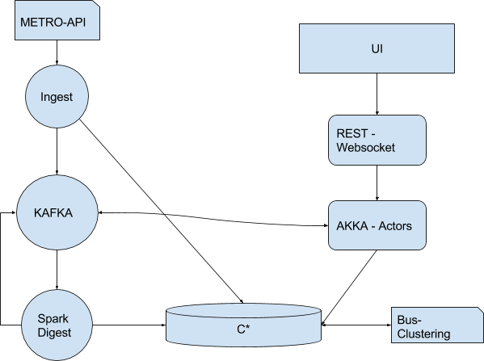
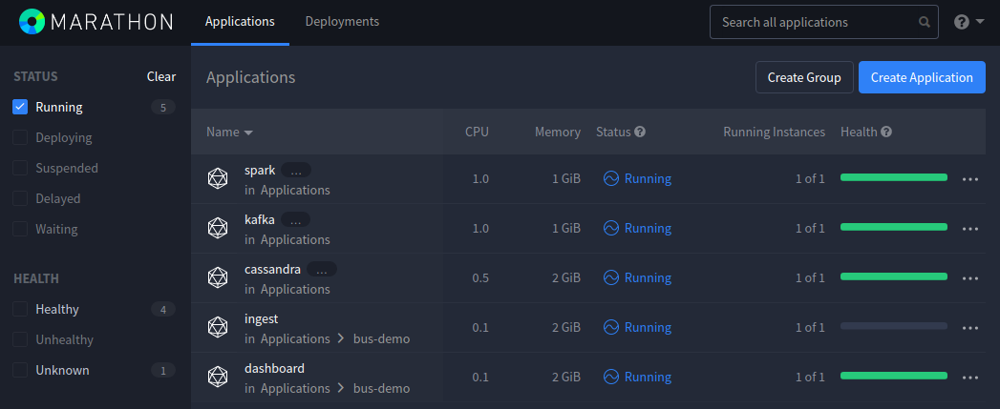
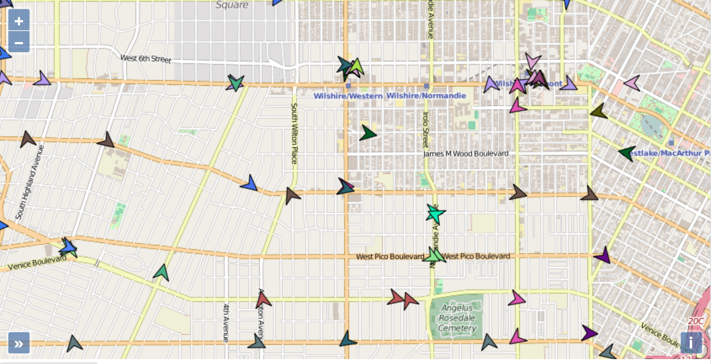

# Iot Fast Data analytics

Or, how to run the SMACK stack on DC/OS with a stream of data.

This showcase is contributed by [Achim Nierbeck from codecentric](https://blog.codecentric.de/en/author/achim-nierbeck/), details can be found in the following blog posts:

 - [Iot Analytics Platform](https://blog.codecentric.de/en/2016/07/iot-analytics-platform/)
 - [SMACK Stack - DC/OS Style](https://blog.codecentric.de/en/2016/08/smack-stack-dcos-style/)

The code used in this demo can be found in the following code repository:

 - [github.com/ANierbeck/BusFloatingData](https://github.com/ANierbeck/BusFloatingData)

In short, with this showcase you'll receive live data from the Los Angeles METRO API. The data is streamed to Apache Kafka and consumed by Apache Spark and an Akka application.

NOTE: As we are using live data from Los Angeles, there might be very few buses on the map depending on the time of day in your timezone.

**Table of Contents**

- [Architecture](#architecture)
- [Prerequisites](#prerequisites)
- [Install](#install) the demo
- [Use](#use) the demo

## Architecture
This is just an excerpt of details to be found in the following blog [Iot Analytics Platform](https://blog.codecentric.de/en/2016/07/iot-analytics-platform/). The architecture is split into the following parts:

- Ingest – [Akka](https://akka.io)
- Streaming - [Kafka](https://kafka.apache.org)
- Digest – [Spark](https://spark.apache.org)
- Backend – Akka
- Storage - [Cassandra](http://cassandra.apache.org)
- UI – Javascript, Openstreetmap



The **ingest** retrieves the data from an REST endpoint at the Los Angeles METRO API, and streams this data into Kafka. From there the data is **digested** by a Spark streaming job, and stored in a Cassandra NoSQL database. This data which has been transformed for Cassandra (see blog post for the why), is now send back again to Kafka and consumed by an Akka backend. The UI Uses either REST or Websockets to retrieve the data from Cassandra or Kafka via the Akka backend.

## Prerequisites

- A DC/OS cluster running [1.13](https://dcos.io/releases/) or later, with at least 4 private agents and 1 public agent each with 2 CPUs and 5 GB of RAM available as well as the [DC/OS CLI](https://docs.mesosphere.com/1.13/cli/) installed in version 0.14 or higher.
- The JSON query util [jq](https://github.com/stedolan/jq/wiki/Installation) must be installed.
- [SSH](https://docs.mesosphere.com/1.13/administering-clusters/sshcluster/) cluster access must be set up.
- The [dcos/demo](https://github.com/dcos/demos/) Git repo must be available locally, use `git clone https://github.com/dcos/demos.git` if you haven't done so, yet.
- Dashboard application access relies on a couple of different ports, `TCP/8000` and `TCP/8001`.  These are exposed on the public agent node and need to be reachable from your client.

## Install

### Spark

Install the DC/OS Apache Spark package (Version 2.5.0-2.2.1 is required here for compatibility):

```bash
dcos package install spark --options=configuration/spark.json --package-version=2.5.0-2.2.1
```

### Cassandra

Install the DC/OS Apache Cassandra package:

```bash
dcos package install cassandra
```

Once it sucessfully deployed, check the `dcos cassandra` subcommand:

```bash
dcos cassandra endpoints native-client
```

The setup of the required Cassandra schema is done via a [job](https://docs.mesosphere.com/1.13/deploying-jobs/).

With the jobs frontend you're able to use the following configuration which will pull down a simple Docker Hub image with code from the [BusFloatingData](https://github.com/ANierbeck/BusFloatingData) repository and the [import_data.sh](bus-demo/import_data.sh) script.

```json
{
  "id": "init-cassandra-schema-job",
  "description": "Initialize cassandra database",
  "run": {
    "cmd": "/opt/bus-demo/import_data.sh node-0-server.cassandra.autoip.dcos.thisdcos.directory",
    "cpus": 0.1,
    "mem": 256,
    "disk": 0,
    "docker": {
      "image": "dcos/bus-demo-schema:3.11.4"
    }
  }
}
```

Alternatively, we can use the DC/OS CLI. For this use the [cassandra-schema.json](configuration/cassandra-schema.json) file.

Issue the following command line:
```bash
dcos job add configuration/cassandra-schema.json
dcos job run init-cassandra-schema-job
```

This will start a job, which initializes the Cassandra database with a schema.  Verify that the job has run successfully as follows:

``` bash
$ dcos job list
            ID             STATUS       LAST RUN
init-cassandra-schema-job  Unscheduled  Success
```

### Kafka

Install the DC/OS Apache Kafka package:

```bash
dcos package install kafka
```

### Ingestion

Now that the basic SMACK infrastructure is available, let's start with the ingestion part of the setup.
Again there are two ways of installing this application - through the UI, or by using the DC/OS CLI.

Using the UI, copy and paste the JSON into the JSON editor:

```json
{
  "id": "/bus-demo/ingest",
  "cpus": 0.1,
  "mem": 2048,
  "disk": 0,
  "instances": 1,
  "container": {
    "type": "MESOS",
    "volumes": [],
    "docker": {
      "image": "mesosphere/akka-ingest:0.2.2",
      "privileged": false,
      "parameters": [],
      "forcePullImage": true
    }
  },
  "env": {
    "CASSANDRA_CONNECT": "node-0-server.cassandra.autoip.dcos.thisdcos.directory:9042",
    "KAFKA_CONNECT": "broker.kafka.l4lb.thisdcos.directory:9092"
  }
}
```

Or via the DC/OS CLI with the [akka-ingest.json](configuration/akka-ingest.json) file. Issue the following command:

```bash
dcos marathon app add configuration/akka-ingest.json
```

### Spark Jobs

The processing part of the application is done via Spark jobs. To run those jobs you'll need to use the DC/OS CLI via the following command:

```bash
dcos spark run --submit-args='--driver-cores 0.1 --driver-memory 1024M --total-executor-cores 4 --class de.nierbeck.floating.data.stream.spark.KafkaToCassandraSparkApp https://oss.sonatype.org/content/repositories/snapshots/de/nierbeck/floating/data/spark-digest_2.11/0.5.0-SNAPSHOT/spark-digest_2.11-0.5.0-SNAPSHOT-assembly.jar METRO-Vehicles node-0-server.cassandra.autoip.dcos.thisdcos.directory:9042 broker.kafka.l4lb.thisdcos.directory:9092'
```

### Dashboard Application

The dashboard application will take care of the front end and the communication with Cassandra and Kafka.

Either install it via the DC/OS UI by creating a new Marathon app:

```json
{
  "id": "/bus-demo/dashboard",
  "container": {
    "type": "MESOS",
    "docker": {
      "image": "mesosphere/akka-server:0.2.2",
      "forcePullImage": true
    }
  },
  "acceptedResourceRoles": [
    "slave_public"
  ],
  "env": {
      "CASSANDRA_CONNECT": "node-0-server.cassandra.autoip.dcos.thisdcos.directory:9042",
      "KAFKA_CONNECT": "broker.kafka.l4lb.thisdcos.directory:9092"
  },
  "dependencies": ["/bus-demo/ingest"],
  "healthChecks": [
    {
      "path": "/",
      "protocol": "HTTP",
      "gracePeriodSeconds": 300,
      "intervalSeconds": 60,
      "timeoutSeconds": 20,
      "maxConsecutiveFailures": 3,
      "ignoreHttp1xx": false,
      "port": 8000
    }
  ],
  "cpus": 0.1,
  "mem": 2048.0,
  "ports": [
    8000, 8001
  ],
  "requirePorts" : true
}
```

Or by using the DC/OS CLI and the [dashboard.json](configuration/dashboard.json) file:

```bash
dcos marathon app add configuration/dashboard.json
```

After that you should have a nice list of applications:



## Use

Now that we successfully installed the application, let's take a look at the dashboard. For this we just need to navigate to the `http://$PUBLIC_AGENT_IP:8000/`. Details about finding out how to find your public agent's IP can be found in the [documentation](https://docs.mesosphere.com/1.13/administering-clusters/locate-public-agent/). The application will give you a map where with every poll of the bus-data, that data is streamed into the map via a websocket connection:



Besides the real-time data streamed into the map, it's possible to request the data from the last 15 minutes, taken from Cassandra.

At this point may it's worth revisiting the the full blog about what can be done with this use-case at [Iot Analytics Platform](https://blog.codecentric.de/en/2016/07/iot-analytics-platform/). It will give you much better details about why the incoming x,y position data is combined to be in a quadkey.

You also can find some more details about the second use-case on with this showcase. How to use a “Density-Based Clustering in Spatial Databases” (DBSCAN) grouping algorithm to find clusters of Busses, and to actually compute where there are major bus-stops.

### Feedback

Should you have any questions or suggestions concerning the demo, please raise an [issue](https://jira.mesosphere.com/) in Jira or let us know via the [users@dcos.io](mailto:users@dcos.io) mailing list.
