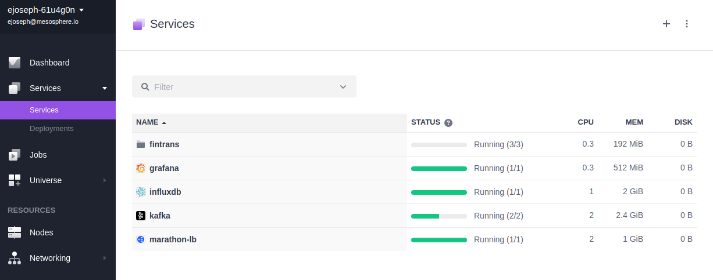
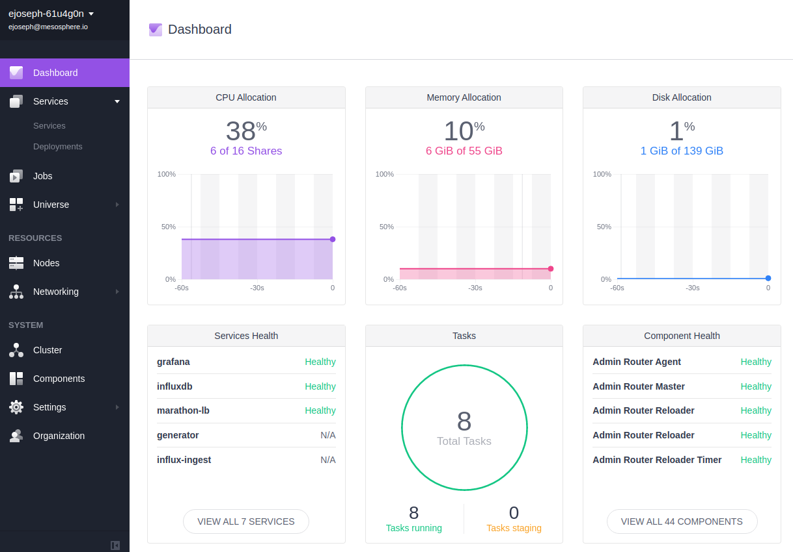

# Fast Data: Financial Transaction Processing

This demo is all about processing, visualizing and understanding high-volume financial transactions. There are several challenges that we tackle here: 1. the frequency of transactions, 2. the volume of transactions, 3. scaling out the processing. 

For the sake of this demo let's assume you're responsible for building a data processing infrastructure that allows insights about recent transactions from multiple locations (with recent being, for example, the past hour) as well as being able to spot fraudulent transactions, for example such that violate money laundering regulations. In the context of money laundering, what happens is that a large amount, say $1,000,000 is split into many small batches, each just under the allowed value of, for example, $10,000. With many tens or hundreds thousands of transactions going on at any given point in time it's hard to keep a running total for each account in real time and react appropriately. Failure to report or react on attempted money laundering typically means fines for the financial institutions—something best avoided altogether. See also [US](https://www.fincen.gov/history-anti-money-laundering-laws) and [EU](http://eur-lex.europa.eu/legal-content/EN/TXT/?uri=CELEX%3A32015L0849) legislation and regulations on this topic for more information.

- Estimated time for completion: 
 - Single command: 10min
 - Manual: 25min
 - Development: unbounded
- Target audience: Anyone interested stream data processing and analytics with Apache Kafka.

**Table of Contents**:

- [Architecture](#architecture)
- [Prerequisites](#prerequisites)
- Install the demo:
 - [Single command](#single-command)
 - [Manual](#manual)
- [Use](#use) the demo
 - [Generating transactions](#generating-transactions)
 - [Consuming transactions](#consuming-transactions)
- [Development and testing](#development)

## Architecture


Apache Kafka plays the central role in the architecture of this demo. There is one producer, the [generator](#generating-transactions)
and two [consumers](#consuming-transactions), three stateless [DC/OS services](service/) written in Go. The generator continuously produces
(random) financial transactions and pushes them into Kafka. One consumer reads out these transactions and ingests it into InfluxDB,
a time series datastore with a retention period of one hour, and further on is connected to Grafana to provide a visual representation.
A second consumer reads out the transactions and performs a simple fraud detection on it, enabling a human operator to review potential
money laundering activities.

## Prerequisites

- A running [DC/OS 1.9.0](https://dcos.io/releases/1.9.0/) or higher cluster with at least 3 private agents and 1 public agent each with 2 CPUs and 5 GB of RAM available as well as the [DC/OS CLI](https://dcos.io/docs/1.9/usage/cli/install/) installed in version 0.14 or higher.
- The [dcos/demo](https://github.com/dcos/demos/) Git repo must be available locally, use: `git clone https://github.com/dcos/demos.git` if you haven't done so, yet.
- The JSON query util [jq](https://github.com/stedolan/jq/wiki/Installation) must be installed.
- [SSH](https://dcos.io/docs/1.9/administration/access-node/sshcluster/) cluster access must be set up.

Going forward we'll call the directory you cloned the `dcos/demo` Git repo into `$DEMO_HOME`.

The DC/OS services and support libraries used in the demo are as follows:

- Apache Kafka 0.10.0 with Shopify's [sarama](https://godoc.org/github.com/Shopify/sarama) package, client-side.
- InfluxDB 0.13.0 with [influxdata v2](https://godoc.org/github.com/influxdata/influxdb/client/v2) package, client-side.
- Grafana v3.1.1

## Install

After either single command install or manual install method your DC/OS UI should look as follows:



### Single command

If you want to install the demo with a single command, use:

```bash
$ cd $DEMO_HOME/fintrans/1.9
$ ./install-all.sh
```

Now continue with the [Grafana](#grafana-influxdb) setup and after that you're ready to [use](#use) the demo.

### Manual

If you want to install the demo manually here are the required services that you'd need to set up.

#### InfluxDB

Install InfluxDB with the following [options](influx-ingest/influx-config.json):

```bash
$ cd $DEMO_HOME/fintrans/1.9/influx-ingest/
$ dcos package install --options=influx-config.json influxdb
```

#### Grafana

Install Marathon-LB and Grafana (the latter uses the former to be accessible from outside the cluster):

```bash
$ dcos package install marathon-lb
$ dcos package install grafana

```

<a name="grafana-influxdb"></a>
The Grafana dashboard is available on `$PUBLIC_AGENT_IP:13000`, and if you don't know `$PUBLIC_AGENT_IP` yet, [find it out first](https://dcos.io/docs/1.9/administration/locate-public-agent/). Log in with: `admin`/`admin`.

Next, we set up InfluxDB as a data source in Grafana, effectively connecting Grafana to InfluxDB. Use the following values after selecting Add a data source:

- In the top of the config use the following:
  - Name: influx
  - Type: InfluxDB
- In the `Http settings` section, select `Basic Auth` and `With Credentials` and use:
 - Url value: `http://influxdb.marathon.l4lb.thisdcos.directory:8086`
 - User value: `root`
 - Password value: `root` 
- In the `InfluxDB Details` section:
 - Database value: `fintrans` 
 - Leave User/Password fields here empty

The result should look as follows (note the `Success` message after you hit the `Save & Test` button):


Note that if you came here from the single command install then you're done: you're ready to [use](#use) the demo.

#### Kafka

Install the Apache Kafka package with the following [options](kafka-config.json):

```bash
$ cd $DEMO_HOME/fintrans/1.9/
$ dcos package install kafka --options=kafka-config.json
```

Note that if you are unfamiliar with Kafka and its terminology, you can check out the respective [101 example](https://github.com/dcos/examples/tree/master/1.8/kafka) as well now.

Next, figure out where the broker is:

```bash
$ dcos kafka endpoints broker

{
  "address": [
    "10.0.3.178:9398"
  ],
  "zookeeper": "master.mesos:2181/dcos-service-kafka",
  "dns": [
    "broker-0.kafka.mesos:9398"
  ],
  "vip": "broker.kafka.l4lb.thisdcos.directory:9092"
}
```

Note the FQDN for the broker, in our case `broker-0.kafka.mesos:9398`, you will need it if you want to do local [development and testing](#development).

### Generator and consumers

Last but not least it's time to launch the financial transaction generator and the consumers:

```bash
$ cd $DEMO_HOME/fintrans/1.9/
$ ./install-services.sh
deploying the fintrans generator ...
Created deployment 56d3e77d-08e6-4a43-87cd-bcc6a107e8c3
==========================================================================
deploying the recent financial transactions consumer ...
Created deployment 78440e10-17e0-4046-b22d-d60fd388ffad
==========================================================================
deploying the money laundering detector ...
Created deployment 7e2cd878-d651-4cb2-bf87-7d25799758a3
DONE ====================================================================
```

Now, since we have all components, that is, Kafka, InfluxDB, Grafana, the fintrans generator and the two consumer services installed, we are ready to use the demo.

## Use

The following sections describe how to use the demo after having installed it.

### Generating transactions

In order to do something with the transactions we first need to generate them. If you have installed the demo (either with the [single command](#single-command) or the [manual](#manual) method) there is no further action required from your side and you can continue with [consuming transactions](#consuming-transactions). If you want to do local testing and development, jump to the [respective section](#development) and continue there.

A quick note concerning how transactions are represented on a logical level. We are using the following format:

```
source_account target_account amount
```

For example, `396 465 6789` means that $6789 have been transferred from account no `396` to `465`.

It's the job of the [generator](generator/) to produce a stream of random financial transactions. The generator itself is stateless and ingests the transactions into Kafka, organized by city. That is, the city the transaction originated in is represented by a Kafka topic. The five cities used are:

    London
    NYC
    SF
    Moscow
    Tokyo


Note that if you want to reset the topics, that is remove all messages for a certain topic (= city) stored in Kafka, you can do a `dcos kafka topic list` and `dcos kafka topic delete XXX` with `XXX` being one of the listed topics (cities).

### Consuming transactions

The core piece of this demo is consuming the financial transactions in some meaningful way. We provide two consumers here but you're encouraged to add others that aggregate data or act on certain patterns.

#### Recent transactions dashboard

One consumer of the transactions we stored in Kafka is a combination of InfluxDB and Grafana, called the [influx-ingest](influx-ingest/) consumer.
This consumer uses Grafana as the visual frontend, showing a breakdown of average and total transaction volume per city for the past hour. 

Now, to see the recent financial transaction streaming in, locate the Grafana dashboard at `$PUBLIC_AGENT_IP:13000` (note: you might need to [find out the IP of the public agent](https://dcos.io/docs/1.9/administration/locate-public-agent/ ) first and log in with: `admin`/`admin`. Once logged in, create a new Grafana dashboard by loading the prepared [Grafana dashboard json file](influx-ingest/grafana-dashboard.json) and you should see something like this:


Feel free to change the Grafana graphs or add new ones, at this stage.

#### Money laundering detector

Another consumer of the transactions stored in Kafka is the money [laundering detector](laundering-detector/). It is a command line tool that alerts when the aggregate transaction volume from a source to a target account exceeds a configurable treshold. The idea behind this is to highlight potential money laundering attempts to a human operator who then has to verify manually if a fraudulent transaction has been taken place.

In order to see the money laundering alerts, locate the money laundering detector service in the DC/OS UI. Look for and click on the service with name `laundering-detector` under `fintrans/` and then click on the task ID that looks something like `fintrans_laundering-detector.xxxx`. From there, go to the `Files` tab and hover over the `stdout` file, a magnifying glass will appear which you can click on to view the log file in the browser:. You should see something like this:


Alternatively, from the command line, you can see the logs as follows:

1. Find out the task ID of the money laundering detector with `dcos task`.
1. Use `dcos task log --follow $TASKID` to view the logs with the task ID you found in the previous step.

An exemplary session looks like so:

```bash
$ dcos task
NAME                          HOST        USER  STATE  ID
broker-0                      10.0.3.178  root    R    broker-0__a0b599da-391b-480b-a5ed-f566dd8baab4
broker-1                      10.0.3.176  root    R    broker-1__a1e0047b-a697-4d19-ae8f-230fe6f9fc0a
broker-2                      10.0.3.177  root    R    broker-2__330430dc-4541-4af7-91a8-4b1c533917b1
generator.fintrans            10.0.3.178  root    R    fintrans_generator.5b9b2ad4-bd5e-11e6-be40-fecdab8d68a1
grafana                       10.0.3.178  root    R    grafana.3405e61e-bb9d-11e6-be40-fecdab8d68a1
influx-ingest.fintrans        10.0.3.178  root    R    fintrans_influx-ingest.5e97c905-bd5e-11e6-be40-fecdab8d68a1
influxdb                      10.0.3.178  root    R    influxdb.328a7b9c-bb9b-11e6-be40-fecdab8d68a1
kafka                         10.0.3.177  root    R    kafka.d0fdf95b-ba1a-11e6-be40-fecdab8d68a1
laundering-detector.fintrans  10.0.3.177  root    R    fintrans_laundering-detector.5e97c906-bd5e-11e6-be40-fecdab8d68a1
marathon-lb                   10.0.7.58   root    R    marathon-lb.27367add-bb9d-11e6-be40-fecdab8d68a1

$ dcos task log --follow fintrans_laundering-detector.5e97c906-bd5e-11e6-be40-fecdab8d68a1
POTENTIAL MONEY LAUNDERING: 516 -> 482 totalling 8644 now
POTENTIAL MONEY LAUNDERING: 246 -> 308 totalling 9336 now
POTENTIAL MONEY LAUNDERING: 856 -> 804 totalling 8994 now
POTENTIAL MONEY LAUNDERING: 233 -> 954 totalling 8710 now
POTENTIAL MONEY LAUNDERING: 318 -> 273 totalling 8883 now
POTENTIAL MONEY LAUNDERING: 303 -> 24 totalling 8431 now
^CUser interrupted command with Ctrl-C
```

Note that the alert treshold by default is set to $8000 but you can change that at any time by editing the [service definition](service/laundering-detector.json).

## Development

If you are interested in testing this demo locally or want to extend it, follow the instructions in this section.
Note that while the generator and consumers can run locally, you will still need a DC/OS cluster with Kafka, InfluxDB and Grafana running
in order to carry out all the tasks.

### Tunneling 

For local development and testing we use [DC/OS tunneling](https://dcos.io/docs/1.9/administration/access-node/tunnel/) to make the nodes directly accessible on the development machine. The following instructions are only an example (using Tunnelblick on macOS) and the concrete steps necessary depend on your platform as well as on what VPN client you're using.

```bash
$ sudo dcos tunnel vpn --client=/Applications/Tunnelblick.app/Contents/Resources/openvpn/openvpn-2.3.12/openvpn
Password:
*** Unknown ssh-rsa host key for 35.156.70.254: 13ec7cde1d3967d2371eb375f48c4690

ATTENTION: IF DNS DOESN'T WORK, add these DNS servers!
198.51.100.1
198.51.100.2
198.51.100.3

Waiting for VPN server in container 'openvpn-6nps1efm' to come up...

VPN server output at /tmp/tmpn34d7n0d
VPN client output at /tmp/tmpw6aq3v4z
```

Note that it is necessary to [add the announced DNS servers]( https://support.apple.com/kb/PH18499?locale=en_US) as told by Tunnelblick, and make sure the are they appear at the top of the list, before any other DNS server entries.

### Generating and consuming transactions

For a local dev/test setup, and with [DC/OS VPN tunnel](#tunneling) enabled, we can run the fintrans generator as follows:

```bash
$ cd $DEMO_HOME/fintrans/1.9/generator/
$ go build
$ ./generator --broker broker-0.kafka.mesos:9398
INFO[0001] &sarama.ProducerMessage{Topic:"London", Key:sarama.Encoder(nil), Value:"678 816 2957", Metadata:interface {}(nil), Offset:10, Partition:0, Timestamp:time.Time{sec:0, nsec:0, loc:(*time.Location)(nil)}, retries:0, flags:0}
INFO[0003] &sarama.ProducerMessage{Topic:"SF", Key:sarama.Encoder(nil), Value:"762 543 6395", Metadata:interface {}(nil), Offset:4, Partition:0, Timestamp:time.Time{sec:0, nsec:0, loc:(*time.Location)(nil)}, retries:0, flags:0}
INFO[0005] &sarama.ProducerMessage{Topic:"London", Key:sarama.Encoder(nil), Value:"680 840 8115", Metadata:interface {}(nil), Offset:11, Partition:0, Timestamp:time.Time{sec:0, nsec:0, loc:(*time.Location)(nil)}, retries:0, flags:0}
^C
```

Again, assuming [DC/OS VPN tunnel](#tunneling) is enabled, you can run the recent transactions dashboard (feeding InfluxDB/Grafana) from your local development machine as follows. First, you need to find out the InfluxDB API URL and provide it via the environment variable `INFLUX_API` (in our case, looking up where the InfluxDB instance runs, using the higher of the two ports, the URL is `http://10.0.3.178:11973`):

```bash
$ cd $DEMO_HOME/fintrans/1.9/influx-ingest/
$ go build
$ INFLUX_API=http://10.0.3.178:11973 ./influx-ingest --broker broker-0.kafka.mesos:9398
INFO[0003] Got main.Transaction{City:"Tokyo", Source:"836", Target:"378", Amount:1211}  func=consume
INFO[0003] Connected to &client.client{url:url.URL{Scheme:"http", Opaque:"", User:(*url.Userinfo)(nil), Host:"10.0.3.178:11973", Path:"", RawPath:"", RawQuery:"", Fragment:""}, username:"root", password:"root", useragent:"InfluxDBClient", httpClient:(*http.Client)(0xc82000bb30), transport:(*http.Transport)(0xc8200d00c0)}  func=consume
INFO[0003] Preparing batch &client.batchpoints{points:[]*client.Point(nil), database:"fintrans", precision:"s", retentionPolicy:"", writeConsistency:""}  func=consume
INFO[0003] Added point &client.Point{pt:(*models.point)(0xc8200839e0)}  func=consume
INFO[0003] Ingested &client.batchpoints{points:[]*client.Point{(*client.Point)(0xc82000f9f0)}, database:"fintrans", precision:"s", retentionPolicy:"", writeConsistency:""}  func=ingest2Influx
^C
```

You can launch the money laundering detector as follows from your local development machine (note: [DC/OS VPN tunnel](#tunneling) must be enabled):

```bash
$ cd $DEMO_HOME/fintrans/1.9/laundering-detector/
$ go build
$ ALERT_THRESHOLD=6000 PROD_OUTPUT=false ./laundering-detector --broker broker-0.kafka.mesos:9398
INFO[0002] Queued main.Transaction{City:"SF", Source:"970", Target:"477", Amount:1102}  func=consume
INFO[0002] Dequeued main.Transaction{City:"SF", Source:"970", Target:"477", Amount:1102}  func=detect
INFO[0002] 970 -> 477 totalling 1102 now                 func=detect
INFO[0002] Current queue length: 0                       func=detect
INFO[0004] Queued main.Transaction{City:"London", Source:"236", Target:"367", Amount:9128}  func=consume
INFO[0004] Dequeued main.Transaction{City:"London", Source:"236", Target:"367", Amount:9128}  func=detect
INFO[0004] 236 -> 367 totalling 9128 now                 func=detect
POTENTIAL MONEY LAUNDERING: 236 -> 367 totalling 9128 now
^C
``` 

Note that if you're only interested in the money laundering alerts themselves you can execute it as follows, effectively hiding all the `INFO` messages:

```bash
$ ALERT_THRESHOLD=6000 PROD_OUTPUT=false ./laundering-detector --broker broker-0.kafka.mesos:9398 2>/dev/null
POTENTIAL MONEY LAUNDERING: 292 -> 693 totalling 7104 now
POTENTIAL MONEY LAUNDERING: 314 -> 666 totalling 6613 now
^C
```

## Discussion

In this demo we used Kafka to handle the storage and routing of high-volume financial transactions and provided two exemplary ways
how those could be consumed. A few notes concerning the setup and applicability to practical environments:

- While the consumers are deliberately kept simple, you can use them as a basis for a real world implementation.
- Besides monitoring, this architecture and setup is production-ready. Kafka takes care of the scaling issues around data capturing and ingestion and via the System Marathon (`Services` tab in the DC/OS UI) the generator and the two consumers can be scaled. Further, the System Marathon makes sure that should any of the stateless services fail it will be re-started, acting as a distributed supervisor for these long-running tasks.
- The overall utilization of the system, even in the basic configuration, that is, with only a single generator and respectively one consumer of each type is actually pretty good, see also the screen shot of the DC/OS dashboard below.



Should you have any questions or suggestions concerning the demo, please raise an [issue](https://jira.mesosphere.com/) in Jira or let us know via the [users@dcos.io](mailto:users@dcos.io) mailing list.
