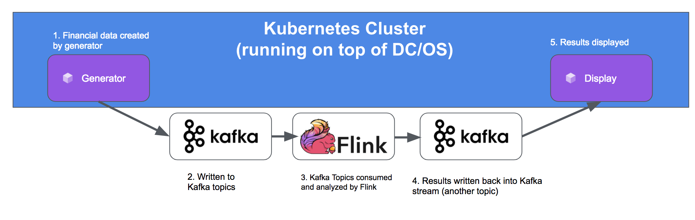
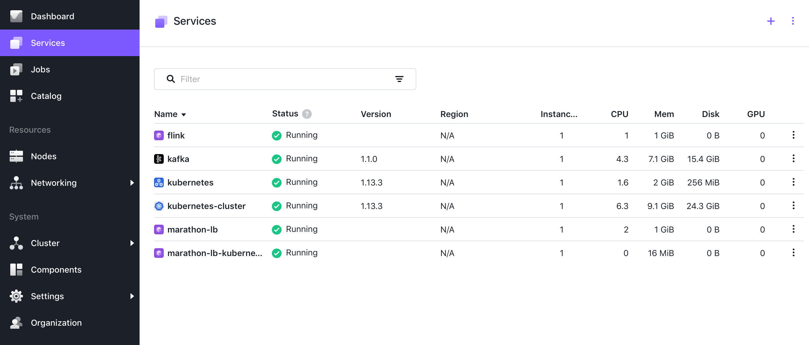
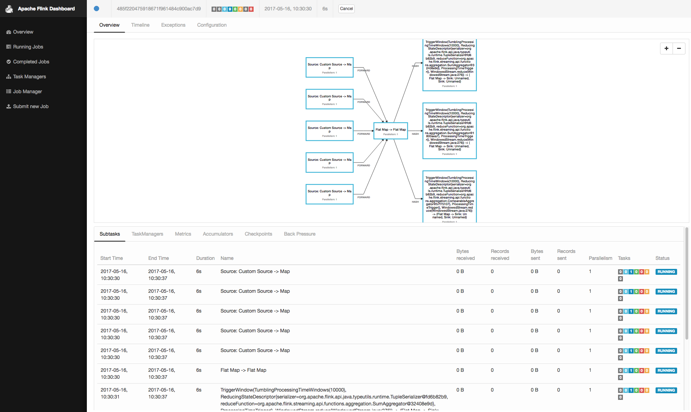

# Fast Data: Financial Transaction Processing with Apache Flink and Kubernetes

During this demo we use Apache Flink and Apache Kafka to setup a high-volume financial transactions pipeline.
Note, this is a derivate of the [Apache Flink Stream Processing](flink/1.12#fast-data-financial-transaction-processing-with-apache-flink) demo, where we use Kubernetes to deploy the generator and viewer microservices.

- Estimated time for completion:
 - Manual install: 15min
- Target audience: Anyone interested in stream data processing and analytics with Apache Kafka and Apache Flink.

A video of this demo can be found [here](https://www.youtube.com/watch?v=bwPXNlVHTeI).

**Table of Contents**:

- [Architecture](#architecture)
- [Prerequisites](#prerequisites)
- [Install](#install)
- [Use the demo](#use)
 - [Generating transactions](#generating-transactions)
 - [Consuming transactions](#consuming-transactions)
 - [Viewing output](#viewing-output)

## Architecture



This demo implements a data processing infrastructure that is able to spot money laundering. In the context of money laundering, we  want to detect amounts larger than $10.000 transferred between two accounts, even if that amount is split into many small batches.  See also [US](https://www.fincen.gov/history-anti-money-laundering-laws) and [EU](http://eur-lex.europa.eu/legal-content/EN/TXT/?uri=CELEX%3A32015L0849) legislation and regulations on this topic for more information.

The architecture follows more or less the [SMACK stack architecture](https://mesosphere.com/blog/smack-stack-new-lamp-stack/):
- Events: Event are being generated by a small [GOLANG generator](https://github.com/dcos/demos/blob/master/flink/1.12/generator/generator.go). The events are in the form 'Sunday, 23-Jul-17 01:06:47 UTC;66;26;7810', where the first field '23-Jul-17 01:06:47 UTC' represents the (increasing) timestamp of transactions; the second field '66' represent the sender account; the third field the receiver account; and the fourth field represent the dollar amount transferred during that transaction.
- Ingestion: The generated events are being ingested and buffered by a Kafka queue with the default topic 'transactions'. Being a Microservice we will deploy the data-generator on kubernetes.
- Stream Processing: As we require fast response times, we use Apache Flink as a Stream processor running the [FinancialTransactionJob](https://github.com/dcos/demos/tree/master/flink/1.10/flink-job/src/main/java/io/dcos).
- Storage: Here we diverge a bit from the typical SMACK stack setup and don't write the results into a Datastore such as Apache Cassandra. Instead we write the results again into a Kafka Stream (default: 'fraud'). Note, that Kafka also offers data persistence for all unprocessed events.
- Actor: In order to view the results we use again a small [Golang viewer](https://github.com/dcos/demos/blob/master/flink/1.12/actor/actor_viewer.go) which simply reads and displays the results from the output Kafka stream. Being a Microservice we will deploy the viewer on kubernetes.


## Prerequisites

- A running [DC/OS 1.12](https://dcos.io/releases/) or higher cluster with at least 4 private agents and 1 public agent. Each agent should have 2 CPUs and 5 GB of RAM available. The [DC/OS CLI](https://docs.mesosphere.com/latest/cli/install/) also needs to be installed.


The DC/OS services used in the demo are as follows:

- Apache Kafka
- Apache Flink
- Kubernetes

## Install


#### Kafka

Install the Apache Kafka package :

```shell
dcos package install kafka
```

Note that if you are unfamiliar with Kafka and its terminology, you can check out the respective [101 example](https://github.com/dcos/examples/tree/master/kafka).

Next, figure out where the broker is:

```shell
$ dcos kafka endpoints broker
{
  "address": [
    "10.0.2.64:1025",
    "10.0.2.83:1025",
    "10.0.0.161:1025"
  ],
  "dns": [
    "kafka-0-broker.kafka.autoip.dcos.thisdcos.directory:1025",
    "kafka-1-broker.kafka.autoip.dcos.thisdcos.directory:1025",
    "kafka-2-broker.kafka.autoip.dcos.thisdcos.directory:1025"
  ],
  "vip": "broker.kafka.l4lb.thisdcos.directory:9092"
}
```

Note the FQDN for the vip, in our case `broker.kafka.l4lb.thisdcos.directory:9092`, which is independent of the actual broker locations.
It is possible to use the FQDN of any of the brokers, but using the VIP FQDN will give us load balancing.

##### Create Kafka Topics

Fortunately, creating topic is very simple using the DC/OS Kafka CLI. If you have installed Kafka from the UI you might have to
install the cli extensions using `dcos package install kafka --cli'. If you installed Kafka as above using the CLI then it will automatically install the CLI extensions.

We need two Kafka topics, one with the generated transactions and one for fraudulent transactions, which we can create with:

`dcos kafka topic create transactions`
and
`dcos kafka topic create fraud`

### Flink

Then we can deploy [Apache Flink](https://github.com/dcos/examples/tree/master/flink/):

```shell
dcos package install flink
```

### Kubernetes

As we want to deploy both the generator and viewer microservice on Kubernetes, we need to install Kubernetes next.
The process for this starts with a simple:

```shell
dcos package install kubernetes
```

With this package installed, we then need to create a Kubernetes cluster.  This can done with the following command:

```shell
dcos kubernetes cluster create
```

This will create a default cluster for us, imaginatively titled `kubernetes-cluster`.  We can verify its state as follows:

```shell
$ dcos kubernetes cluster debug plan status deploy --cluster-name=kubernetes-cluster
Using Kubernetes cluster: kubernetes-cluster
deploy (serial strategy) (COMPLETE)
├─ etcd (serial strategy) (COMPLETE)
│  └─ etcd-0:[peer] (COMPLETE)
├─ control-plane (dependency strategy) (COMPLETE)
│  └─ kube-control-plane-0:[instance] (COMPLETE)
├─ mandatory-addons (serial strategy) (COMPLETE)
│  └─ mandatory-addons-0:[instance] (COMPLETE)
├─ node (dependency strategy) (COMPLETE)
│  └─ kube-node-0:[kubelet] (COMPLETE)
└─ public-node (dependency strategy) (COMPLETE)
```

When all those components are in the COMPLETE state, we can move on to the next step which is to expose the Kubernetes APIs outside of the DC/OS cluster.  This enables native K8s clients to be able to talk to them directly.  To do this, we need to install a loadbalancer - and in this example we're going to use [Marathon-LB](https://docs.mesosphere.com/services/marathon-lb/).  Install the package:

``` shell
dcos package install marathon-lb
```

Then we need to define our virtual loadbalancer that will sit in front of and expose the Kubernetes APIs.  We can do this with the following command:

``` shell
dcos marathon app add https://raw.githubusercontent.com/dcos/demos/master/flink-k8s/1.12/k8s/k8s-proxy.json
```

> NB: Depending on how - and where - your DC/OS infrastructure is deployed, you might need to update any firewall (security group) rules as well as adding a listener to your infrastructure's loadbalancer if it's sat in front of your public agent(s).

At this point our K8s cluster is being exposed via Marathon-LB.  To confirm, run the following `curl` command:

``` shell
$ curl -k https://<YOUR EXTERNAL URL>:6443
{
  "kind": "Status",
  "apiVersion": "v1",
  "metadata": {

  },
  "status": "Failure",
  "message": "Unauthorized",
  "reason": "Unauthorized",
  "code": 401
}
```

The `HTTP/401` is an authorisation failure being returned from the K8s API, which shows that we have network connectivity and that it's responding as expected at this point.  With that working, we then need to configure `kubectl` (The Kubernetes command line tool):

```shell
dcos kubernetes cluster kubeconfig \
    --cluster-name=kubernetes-cluster \
    --apiserver-url https://<YOUR EXTERNAL URL>:6443 \
    --insecure-skip-tls-verify
```

> NB: For this command to work, the `dcos` CLI needs to be configured to talk to your DC/OS API via HTTPS.  See additional notes [here](https://docs.mesosphere.com/services/kubernetes/2.2.0-1.13.3/operations/connecting-clients/) for verification and how to change.

And then verify operation of the `kubectl` command:

```shell
$ kubectl get componentstatuses
NAME                 STATUS    MESSAGE             ERROR
scheduler            Healthy   ok
controller-manager   Healthy   ok
etcd-0               Healthy   {"health":"true"}
$ kubectl get nodes
NAME                                                     STATUS   ROLES    AGE   VERSION
kube-control-plane-0-instance.kubernetes-cluster.mesos   Ready    master   49m   v1.13.3
kube-node-0-kubelet.kubernetes-cluster.mesos             Ready    <none>   47m   v1.13.3
```

### Generator

Now, we can deploy the [data generator](https://github.com/dcos/demos/blob/master/flink/1.12/generator/generator.go) using the [flink-demo-generator.yaml deployment definition](https://github.com/dcos/demos/blob/master/flink-k8s/1.12/generator/flink-demo-generator.yaml):

```shell
kubectl apply -f https://raw.githubusercontent.com/dcos/demos/master/flink-k8s/1.12/generator/flink-demo-generator.yaml
```

We can check the status of the deployment:

```shell
kubectl get deployments
kubectl get pods
```

We can also view the log output to make sure it is generating events as expected (you will need to use the actual pod id from the previous command):

```shell
kubectl logs flink-demo-generator-655890656-8d1ls
```


### Final View

After install your DC/OS UI should look as follows:



## Use


The core piece of this demo is the [FinancialTransactionJob](https://github.com/dcos/demos/tree/master/flink/1.12/flink-job/src/main/java/io/dcos) which we will submit to Flink.

First we need to upload the [jar file](https://downloads.mesosphere.com/dcos-demo/flink/flink-job-1.0.jar) into Flink. Please note that the jar file is too large to be included in this github repo, but can be downloaded [here](https://downloads.mesosphere.com/dcos-demo/flink/flink-job-1.0.jar).

In the Services tab of the DCOS UI, hover over the name of the flink service, and click on the link which appears to the right of it. This will open the Flink web UI in a new tab.


In the Flink web UI, click on Submit New Job, then click the Add New button. This will allow you to select the jar file from $DEMO_HOME and upload it.


Once we hit Submit, we should see the job begin to run in the Flink web UI.



### Viewing Output

Now once the Flink job is running, we only need a way to visualize the results. We do that with another [simple Golang app](https://github.com/dcos/demos/blob/master/flink/1.12/actor/actor_viewer.go) and again we will deploy this microservice using Kubernetes via the [flink-demo-actor.yaml deployment definition](https://github.com/dcos/demos/blob/master/flink-k8s/1.12/actor/flink-demo-actor.yaml):
```shell
kubectl apply -f https://raw.githubusercontent.com/dcos/demos/master/flink-k8s/1.12/actor/flink-demo-actor.yaml
```
We can check the status of the deployment:

```shell
kubectl get deployments
kubectl get pods
```

We can also view the log output to make we are detecting fraud as expected (you will need to use the actual pod id from the previous command):

```shell
$ kubectl logs flink-demo-actor--655890656-8d1ls
Detected Fraud:   TransactionAggregate {startTimestamp=0, endTimestamp=1520473325000, totalAmount=23597:
Transaction{timestamp=1520473023000, origin=3, target='7', amount=5857}
Transaction{timestamp=1520473099000, origin=3, target='7', amount=7062}
Transaction{timestamp=1520473134000, origin=3, target='7', amount=9322}
Transaction{timestamp=1520473167000, origin=3, target='7', amount=921}
Transaction{timestamp=1520473325000, origin=3, target='7', amount=435}}

Detected Fraud:   TransactionAggregate {startTimestamp=0, endTimestamp=1520473387000, totalAmount=47574:
Transaction{timestamp=1520472901000, origin=0, target='2', amount=6955}
Transaction{timestamp=1520472911000, origin=0, target='2', amount=4721}
Transaction{timestamp=1520472963000, origin=0, target='2', amount=3451}
Transaction{timestamp=1520473053000, origin=0, target='2', amount=9361}
Transaction{timestamp=1520473109000, origin=0, target='2', amount=5306}
Transaction{timestamp=1520473346000, origin=0, target='2', amount=4071}
Transaction{timestamp=1520473365000, origin=0, target='2', amount=3974}
Transaction{timestamp=1520473387000, origin=0, target='2', amount=9735}}

Detected Fraud:   TransactionAggregate {startTimestamp=0, endTimestamp=1520473412000, totalAmount=21402:
Transaction{timestamp=1520472906000, origin=2, target='3', amount=8613}
Transaction{timestamp=1520473004000, origin=2, target='3', amount=5027}
Transaction{timestamp=1520473050000, origin=2, target='3', amount=924}
Transaction{timestamp=1520473177000, origin=2, target='3', amount=1566}
Transaction{timestamp=1520473412000, origin=2, target='3', amount=5272}}
```

### Helm

You can also install the `Generator` and `Viewer` applications in one step with [Helm](https://github.com/helm/helm), the Kubernetes Package Manager.

#### Install Helm and configure repo

First up, install latest [Helm release](https://github.com/kubernetes/helm#install):

``` shell
$ helm init --history-max 200
```

Then, you need to add this Chart repo:

```shell
$ helm repo add dlc https://dcos-labs.github.io/charts/
$ helm repo update
```

#### Install Flink-demo chart

To install the chart run:

```shell
$ helm install --name flink-demo --namespace flink dlc/flink-demo
NAME:   flink-demo
LAST DEPLOYED: Fri Mar 15 11:15:45 2019
NAMESPACE: flink
STATUS: DEPLOYED

RESOURCES:
==> v1/Pod(related)
NAME                                   READY  STATUS             RESTARTS  AGE
flink-demo-actor-84b4db4479-tjbmt      0/1    ContainerCreating  0         0s
flink-demo-generator-6659cb477b-w2sj6  0/1    ContainerCreating  0         0s

==> v1beta2/Deployment
NAME                  READY  UP-TO-DATE  AVAILABLE  AGE
flink-demo-actor      0/1    1           0          0s
flink-demo-generator  0/1    1           0          0s


NOTES:
To verify that Display and Generator have started:

kubectl --namespace=flink get deployments -l "release=flink-demo, app=flink-demo-actor"
kubectl --namespace=flink get deployments -l "release=flink-demo, app=flink-demo-generator"

$ kubectl --n flink get deployments
NAME                   READY   UP-TO-DATE   AVAILABLE   AGE
flink-demo-actor       1/1     1            1           64s
flink-demo-generator   1/1     1            1           64s

$ kubectl --n flink get pods
NAME                                    READY   STATUS    RESTARTS   AGE
flink-demo-actor-84b4db4479-tjbmt       1/1     Running   0          59s
flink-demo-generator-6659cb477b-w2sj6   1/1     Running   0          59s
```


And finally, we can check the output logs:

```shell
kubectl logs -n flink flink-demo-actor-555c6d9767-hflvb
```

###

Should you have any questions or suggestions concerning the demo, please raise an [issue](https://jira.mesosphere.com/) in Jira or let us know via the [users@dcos.io](mailto:users@dcos.io) mailing list.
