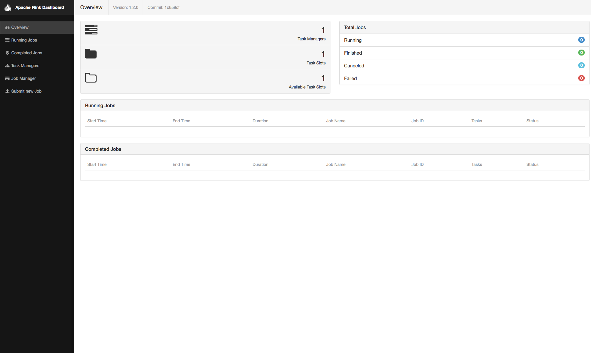
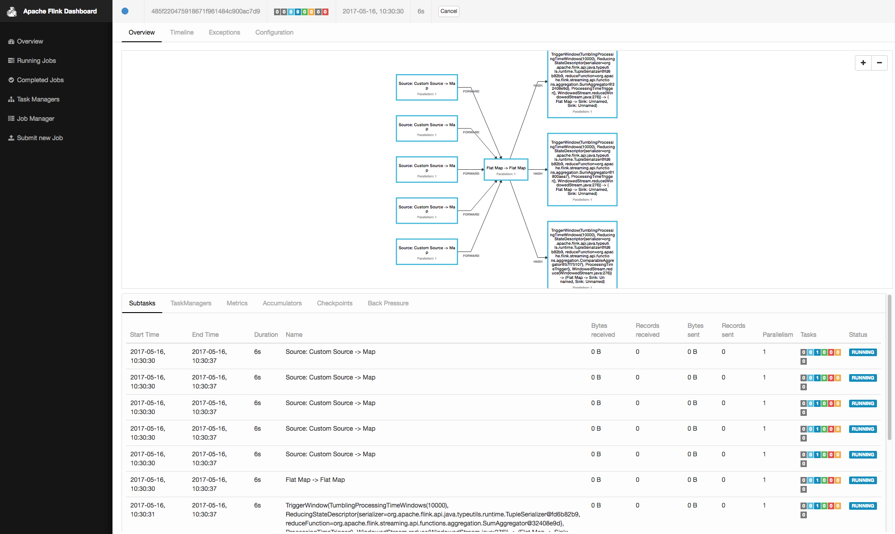

# Fast Data: Financial Transaction Processing with Apache Flink

During this demo we use Apache Flink and Apache Kafka to setup a high-volume financial transactions pipeline.

- Estimated time for completion: 
 - Manual install: 15min
- Target audience: Anyone interested in stream data processing and analytics with Apache Kafka and Apache Flink.

A video of this demo can be found [here](https://www.youtube.com/watch?v=bwPXNlVHTeI).

**Table of Contents**:

- [Architecture](#architecture)
- [Prerequisites](#prerequisites)
- [Install](#install)
- [Use the demo](#use)
 - [Generating transactions](#generating-transactions)
 - [Consuming transactions](#consuming-transactions)
 - [Viewing output](#viewing-output)

## Architecture


This demo implements a data processing infrastructure that is able to spot money laundering. In the context of money laundering, we  want to detect amounts larger than $10.000 transferred between two accounts, even if that amount is split into many small batches.  See also [US](https://www.fincen.gov/history-anti-money-laundering-laws) and [EU](http://eur-lex.europa.eu/legal-content/EN/TXT/?uri=CELEX%3A32015L0849) legislation and regulations on this topic for more information. 

The architecture follows more or less the [SMACK stack architecture](https://mesosphere.com/blog/smack-stack-new-lamp-stack/):
- Events: Event are being generated by a small [GOLANG generator](https://github.com/dcos/demos/blob/master/flink/1.10/generator/generator.go). The events are in the form 'Sunday, 23-Jul-17 01:06:47 UTC;66;26;7810', where the first field '23-Jul-17 01:06:47 UTC' represents the (increasing) timestamp of transactions; the second field '66' represent the sender account; the third field the receiver account; and the fourth field represent the dollar amount transferred during that transaction.
- Ingestion: The generated events are being ingested and buffered by a Kafka queue with the default topic 'transactions'.
- Stream Processing: As we require fast response times, we use Apache Flink as a Stream processor running the [FinancialTransactionJob](https://github.com/dcos/demos/tree/master/flink/1.10/flink-job/src/main/java/io/dcos).
- Storage: Here we diverge a bit from the typical SMACK stack setup and don't write the results into a Datastore such as Apache Cassandra. Instead we write the results again into a Kafka Stream (default: 'fraud'). Note, that Kafka also offers data persistence for all unprocessed events.
- Actor: In order to view the results we use again a small [Golang viewer](https://github.com/dcos/demos/blob/master/flink/1.10/actor/actor_viewer.go) which simply reads and displays the results from the output Kafka stream.


## Prerequisites

- A running [DC/OS 1.10](https://dcos.io/releases/) or higher cluster with at least 3 private agents and 1 public agent. Each agent should have 2 CPUs and 5 GB of RAM available. The [DC/OS CLI](https://dcos.io/docs/1.10/usage/cli/install/) also needs to be installed.
- The [dcos/demo](https://github.com/dcos/demos/) Git repo must be available locally, use: `git clone https://github.com/dcos/demos/` if you haven't done so yet.
- [SSH](https://dcos.io/docs/1.10/administration/access-node/sshcluster/) cluster access must be set up.

The DC/OS services used in the demo are as follows:

- Apache Kafka 
- Apache Flink

## Install

After install your DC/OS UI should look as follows:


#### Kafka

Install the Apache Kafka package :

```bash
$ dcos package install kafka 
```

Note that if you are unfamiliar with Kafka and its terminology, you can check out the respective [101 example](https://github.com/dcos/examples/tree/master/kafka).

Next, figure out where the broker is:

```bash
$ dcos kafka endpoints broker
{
  "address": [
    "10.0.2.47:9571",
    "10.0.1.74:9903",
    "10.0.2.3:9256"
  ],
  "zookeeper": "master.mesos:2181/dcos-service-kafka",
  "dns": [
    "broker-0.kafka.mesos:9571",
    "broker-1.kafka.mesos:9903",
    "broker-2.kafka.mesos:9256"
  ],
  "vip": "broker.kafka.l4lb.thisdcos.directory:9092"
}
```

Note the FQDN for the vip, in our case `broker.kafka.l4lb.thisdcos.directory:9092`, which is independent of the actual broker locations.
It is possible to use the FQDN of any of the brokers, but using the VIP FQDN will give us load balancing.

##### Create Kafka Topics

Fortunately, creating topic is very simple using the DC/OS Kafka CLI. If you have installed Kafka from the UI you might have to 
install the cli extensions using `dcos pacakge install kafka --cli'. If you installed Kafka as above using the CLI then it will automatically install the CLI extensions.

We need two Kafka topics, one with the generated transactions and one for fraudulent transactions, which we can create with:

`dcos kafka topic create transactions`
and
`dcos kafka topic create fraud`


### Generator

After the Kafka queues are created, we can now deploy the [data generator](https://github.com/dcos/demos/blob/master/flink/1.10/generator/generator.go) with this [marathon app definition](https://github.com/dcos/demos/blob/master/flink/1.10/generator/generator.json). As the GoLang generator contains all its dependencies, the app defintion doesn't require a container image and is running without Docker.

`dcos marathon app add https://raw.githubusercontent.com/dcos/demos/master/flink/1.10/generator/generator.json`


### Flink

Finally, we can deploy [Apache Flink](https://github.com/dcos/examples/tree/master/flink/1.10) :

```bash
$ dcos package install flink
```

At this point we have all of the required elements installed - Kafka, Flink and the data generator. We are now ready to start the demo.

## Use


The core piece of this demo is the [FinancialTransactionJob](https://github.com/dcos/demos/tree/flink/flink/1.10/flink-job/src/main/java/io/dcos) which we will submit to Flink.

First we need to upload the [jar file](https://s3-eu-west-1.amazonaws.com/downloads.mesosphere.com/flink/flink-job-1.0.jar) into Flink. Please note that the jar file is too large to be included in this github repo, but can be downloaded [here](https://s3-eu-west-1.amazonaws.com/downloads.mesosphere.com/flink/flink-job-1.0.jar).

In the Services tab of the DCOS UI, hover over the name of the flink service, and click on the link which appears to the right of it. This will open the Flink web UI in a new tab. 



In the Flink web UI, click on Submit New Job, then click the Add New button. This will allow you to select the jar file from $DEMO_HOME and upload it. 


  

Once we hit Submit, we should see the job begin to run in the Flink web UI.



### Viewing Output

Now once the Flink job is running, we only need a way to visualize the results. We do that with another [simple GoLang program](https://github.com/dcos/demos/blob/master/flink/1.10/actor/actor_viewer.go).

`
dcos marathon app add https://raw.githubusercontent.com/dcos/demos/master/flink/1.10/actor/fraudDisplay.json
`

We can easily check the output by checking the task output from the UI.


### 

Should you have any questions or suggestions concerning the demo, please raise an [issue](https://jira.mesosphere.com/) in Jira or let us know via the [users@dcos.io](mailto:users@dcos.io) mailing list.
