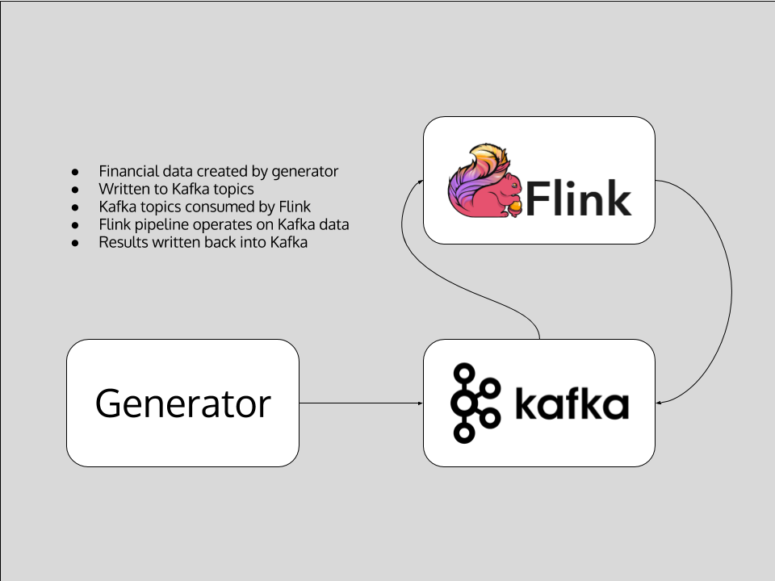
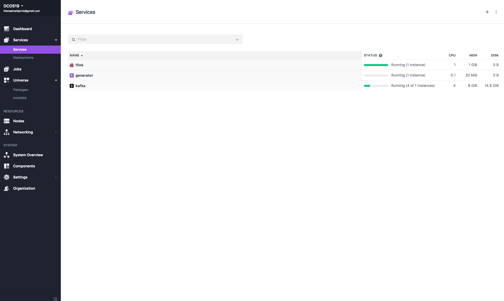
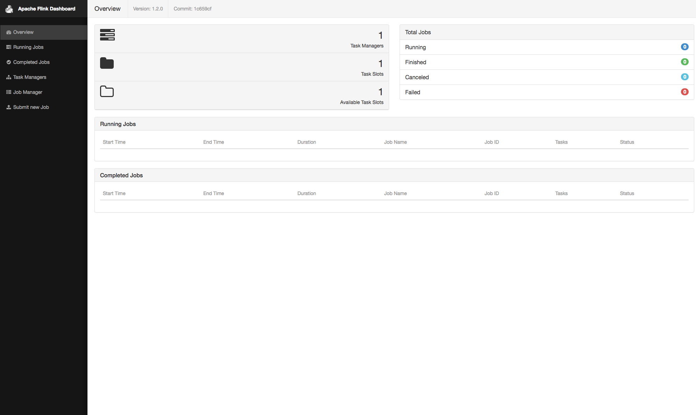
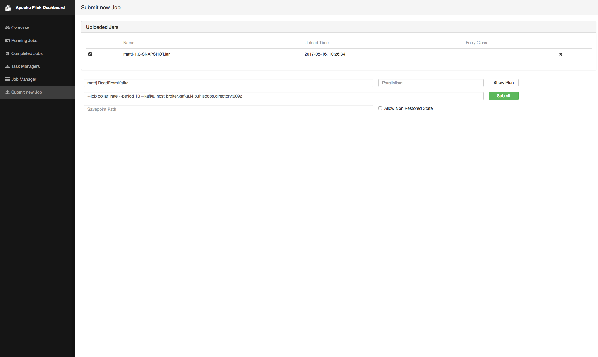
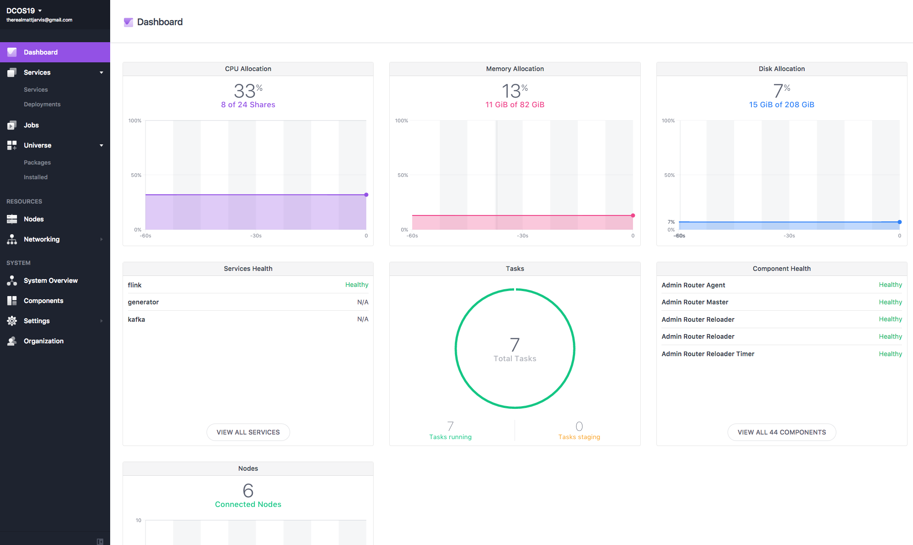

# Fast Data: Financial Transaction Processing

This demo is all about processing and understanding high-volume financial transactions. There are several challenges that we tackle here: 1. the frequency of transactions, 2. the volume of transactions, 3. scaling out the processing. 

- Estimated time for completion: 
 - Manual install: 15min
 - Development: unbounded
- Target audience: Anyone interested in stream data processing and analytics with Apache Kafka and Apache Flink.

**Table of Contents**:

- [Architecture](#architecture)
- [Prerequisites](#prerequisites)
- [Install](#install)
- [Use the demo](#use)
 - [Generating transactions](#generating-transactions)
 - [Consuming transactions](#consuming-transactions)
 - [Viewing output](#viewing-output)

## Architecture



Apache Flink and Apache Kafka are the key elements in the architecture of this demo. There is one producer, the [generator](#generating-transactions), which continuously produces
(random) financial transactions and pushes them into Kafka. There are then three Flink jobs available from a single jar which consume the transactions from Kafka, perform transformations and calculations, and then publish the new data back into Kafka. 

## Prerequisites

- A running [DC/OS 1.9.0](https://dcos.io/releases/1.9.0/) or higher cluster with at least 3 private agents and 1 public agent each with 2 CPUs and 5 GB of RAM available as well as the [DC/OS CLI](https://dcos.io/docs/1.9/usage/cli/install/) installed in version 0.14 or higher.
- The [dcos/demo](https://github.com/mesosphere/matt-demo/) Git repo must be available locally, use: `git clone https://github.com/mesosphere/matt-demo` if you haven't done so, yet.
- The JSON query util [jq](https://github.com/stedolan/jq/wiki/Installation) must be installed.
- [SSH](https://dcos.io/docs/1.9/administration/access-node/sshcluster/) cluster access must be set up.

Going forward we'll call the directory you cloned the `mesosphere/matt-demo` Git repo into `$DEMO_HOME`.

The DC/OS services used in the demo are as follows:

- Apache Kafka 0.10.1.0
- Apache Flink 1.4 

## Install

After install your DC/OS UI should look as follows:



#### Kafka

Install the Apache Kafka package :

```bash
$ dcos package install kafka 
```

Note that if you are unfamiliar with Kafka and its terminology, you can check out the respective [101 example](https://github.com/dcos/examples/tree/master/1.8/kafka) as well now.

Next, figure out where the broker is:

```bash
$ dcos kafka connection
{
  "address": [
    "10.0.2.47:9571",
    "10.0.1.74:9903",
    "10.0.2.3:9256"
  ],
  "zookeeper": "master.mesos:2181/dcos-service-kafka",
  "dns": [
    "broker-0.kafka.mesos:9571",
    "broker-1.kafka.mesos:9903",
    "broker-2.kafka.mesos:9256"
  ],
  "vip": "broker.kafka.l4lb.thisdcos.directory:9092"
}
```

Note the FQDN for the vip, in our case `broker.kafka.l4lb.thisdcos.directory:9092`, you will need it when we configure [Flink](#flink). It is possible to use the FQDN of any of the brokers, but using the VIP FQDN will give us load balancing.

### Generator

Now we need to deploy the generator and the required Kafka topics:

```bash
$ cd $DEMO_HOME
$ ./install-generator.sh 
Installing topics
{
  "message": "Output: Created topic \"London\".\n"
}
{
  "message": "Output: Created topic \"SF\".\n"
}
{
  "message": "Output: Created topic \"Tokyo\".\n"
}
{
  "message": "Output: Created topic \"Moscow\".\n"
}
{
  "message": "Output: Created topic \"NYC\".\n"
}
{
  "message": "Output: Created topic \"dollarrate\".\n"
}
{
  "message": "Output: Created topic \"maxdollars\".\n"
}
{
  "message": "Output: Created topic \"ratecount\".\n"
}
deploying the fintrans generator ...
Created deployment e4925433-f457-4562-b349-dc3ab1a58237
==========================================================================
```

### Flink

Finally we need to deploy Flink :

```bash
$ dcos package install flink
```

As with Kafka, if you are unfamiliar with Flink and its terminology, you can check out the [101 example](https://github.com/dcos/examples/tree/master/flink/1.9)


At this point we have all of the required elements installed, Kafka, Flink and the fintrans generator, we are ready to use the demo.

## Use

The following sections describe how to use the demo after having installed it.

### Generating transactions

A quick note concerning how transactions are represented on a logical level. We are using the following format:

```
source_account target_account amount
```

For example, `396 465 6789` means that $6789 have been transferred from account no `396` to `465`.

It's the job of the [generator](generator/) to produce a stream of random financial transactions. The generator itself is stateless and ingests the transactions into Kafka, organized by city. That is, the city the transaction originated in is represented by a Kafka topic. The five cities used are:

    London
    NYC
    SF
    Moscow
    Tokyo

Note that if you want to reset the topics, that is remove all messages for a certain topic (= city) stored in Kafka, you can do a `dcos kafka topic list` and `dcos kafka topic delete XXX` with `XXX` being one of the listed topics (cities).

### Consuming transactions

The core piece of this demo is consuming the financial transactions in some meaningful way. For this we are using Apache Flink to consume and operate on the data from Kafka. 


In order to use Flink we need to submit a Flink job. Flink provides programming API's for Java, Scala and Python and in our case this is using Java. First we need to upload the jar file into Flink. 

In the Services tab of the DCOS UI, hover over the name of the flink service, and click on the link which appears to the right of it. This will open the Flink web UI in a new tab. 



In the Flink web UI, click on Submit New Job, then click the Add New button. This will allow you to select the jar file from $DEMO_HOME and upload it. 


Once the jar is uploaded, we can configure a job. Select the uploaded jar using the tick box, which will bring up a series of entry boxes to configure the job.

Configure as follows :

Entry Class : mattj.ReadFromKafka

Program Arguments : --job dollar\_rate --period 10 --kafka\_host broker.kafka.l4lb.thisdcos.directory:9092

Note that kafka_host should be the FQDN of the Kafka VIP that we noted earlier. Period is in seconds.



  

The jar file has three possible jobs :

1. dollar_rate - this job calculates the transaction rate in dollars by location over the period
2. max_dollars - this job calculates the highest transaction in dollars by location during the period
3. rate_count - this job calculates the number of transactions by location during the period

Each of these jobs outputs to a different Kafka topic, which were created as part of the generator deployment - the topics are dollarrate, maxdollars and ratecount.

Once we hit Submit, we should see the job begin to run in the Flink web UI.


### Viewing Output

Now our Flink job is running, we can view the output in the Kafka topic. 

First, SSH into the Mesos Master node. 

```bash
$ dcos node ssh --master-proxy --leader
```

From here we now need to create a docker container with the Kafka client tools in it 

```bash
core@ip-10-0-6-114 ~ $ docker run -it mesosphere/kafka-client
Unable to find image 'mesosphere/kafka-client:latest' locally
latest: Pulling from mesosphere/kafka-client
efd26ecc9548: Pull complete 
a3ed95caeb02: Pull complete 
d1784d73276e: Pull complete 
52a884c93bb2: Pull complete 
070ee56a6f7e: Pull complete 
f8b8b1302b4f: Pull complete 
e71221cc9598: Pull complete 
349c9e35d503: Pull complete 
0686c3f0e36a: Pull complete 
Digest: sha256:92eacfe5cf19bb194d3b08e92a3bde985777da765a3aa5398f275cfc8d7e27c7
Status: Downloaded newer image for mesosphere/kafka-client:latest
```

At this point we will have a shell into the kafka client container, and we can view the topic :

```bash
root@1ff7f963f9c3:/bin# ./kafka-console-consumer.sh --zookeeper leader.mesos:2181/dcos-service-kafka --topic dollarrate --from-beginning
Moscow 9070
SF 2212
London 15455
Moscow 6761
Moscow 9291
NYC 553
SF 4838
NYC 12528
Tokyo 6264
Moscow 5097
SF 4199
Moscow 8632
SF 8697
SF 12292
Tokyo 8036
Tokyo 8398
London 10090
Moscow 16001
Tokyo 9403
```

So we can see our Kafka output topic now has data flowing into it consisting of a space separated string of in the format $location $amount, this is in dollars over the period we defined for the Flink job. This confirms that our pipeline of Kafka -> Flink -> Kafka is working correctly, and the Flink job is transforming our input data into meaningful output data.  

## Discussion

In this demo we used Kafka to handle the storage and routing of high-volume financial transactions and Flink to transform that data into useful output. A few notes concerning the setup and applicability to practical environments:

- Besides monitoring, this architecture and setup is production-ready. Kafka takes care of the scaling issues around data capturing and ingestion, Flink handles scaling of jobs submitted to it, and via the System Marathon (`Services` tab in the DC/OS UI) the generator can be scaled. Further, the System Marathon makes sure that should any of the stateless services fail it will be re-started, acting as a distributed supervisor for these long-running tasks.
- The overall utilization of the system, even in the basic configuration, that is, with only a single generator and one Flink job is actually pretty good, see also the screen shot of the DC/OS dashboard below.



Should you have any questions or suggestions concerning the demo, please raise an [issue](https://jira.mesosphere.com/) in Jira or let us know via the [users@dcos.io](mailto:users@dcos.io) mailing list.
