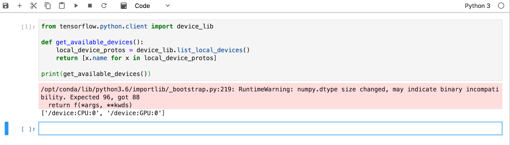

# Fast Data: Data Analytics with JupyterLab, Spark and TensorFlow

In this demo we will assume the role of a Data Scienctist and use [JupyterLab](https://github.com/jupyterlab/jupyterlab) to preprocess and analyze datasets with Spark and TensorFlow.
The technologies used in the demo are as follows:

- [JupyterLab](https://github.com/jupyterlab/jupyterlab)
- [HDFS](https://hadoop.apache.org/docs/r1.2.1/hdfs_user_guide.html)
- [Apache Spark](https://spark.apache.org/)
- [TensorFlow](https://www.tensorflow.org/) using the [Yahoo TensorFlowOnSpark distribution](https://github.com/yahoo/TensorFlowOnSpark)
- [Marathon-LB](https://docs.mesosphere.com/services/marathon-lb/) to expose JupyterLab externally


- Estimated time for completion:
 - Manual install: 20min
- Target audience: Anyone interested in Data Analytics.

**Table of Contents**:

- [Prerequisites](#prerequisites)
- [Install](#install)
- [Use the demo](#demo)


## Prerequisites

- A running [DC/OS 1.11](https://dcos.io/releases/) or higher cluster with at least 6 private agents and 1 public agent. Each agent should have 2 CPUs and 5 GB of RAM available. The [DC/OS CLI](https://docs.mesosphere.com/latest/cli/install/) also needs to be installed. If you plan to use GPU support we recommend to use the [dcos-terraform project](https://github.com/dcos/terraform-dcos/blob/master/aws/README.md#adding-gpu-private-agents) to provision DC/OS. Please refer to the the [GPU Cluster Provisioning section](https://github.com/dcos/examples/tree/master/jupyterlab/1.11#install-jupyterlab-with-gpu-support) in the README for more details.


## Install

#### HDFS

You can install the HDFS service from the DC/OS UI or directly from the CLI:

```bash
$ dcos package install hdfs
```

Note that if you want to learn more about HDFS Service or advanced installation options, you can check out the  [HDFS Service Docs](https://docs.mesosphere.com/services/hdfs/).

#### Marathon-LB

In order to expose JupyterLab externally we install [Marathon-LB](https://docs.mesosphere.com/services/marathon-lb/) using

```bash
$ dcos package install marathon-lb
```

### JupyterLab

We can install Jupyterlab also from the UI or CLI. In both cases we need to change two paparameter;

* First the VHOST for exposing the service on a [public agent](https://docs.mesosphere.com/latest/overview/architecture/node-types/) externally.

This means changing the `networking.external_access.external_public_agent_hostname` to the externally reachable VHOST (e.g., the Public Agent ELB in an AWS environment).
We can to that via the UI as shown here:


Or using a [jupyterlab_options.json](./jupyterlab_options.json) file where we need to configure the following setting;

```
    "external_access": {
      "enabled": true,
      "external_public_agent_hostname": "<ADD YOUR VHOST NAME HERE *WITHOUT* trailing / NOR http://>"
    }
```

* Secondly, as we want to access datasets in HDFS during this demo, we need to configure access to HDFS by exposing the necessary config files from the previously installed HDFS.

Again this can be done with the UI install:


Or using the [jupyterlab_options.json](./jupyterlab_options.json) with the following setting:

```
    "jupyter_conf_urls": "http://api.hdfs.marathon.l4lb.thisdcos.directory/v1/endpoints",
```


* After configuring those two settings we can install JupyterLab either with by clicking `Run Service` in the UI:


Or with the CLI and `dcos package install jupyterlab --options=jupyterlab_options.json`.


For more options of installing Jupyterlab please refer to the [installation section in the README](
https://github.com/dcos/examples/tree/master/jupyterlab/1.11#deploy-via-cli)


## Demo

### Login
The first step is to login into JupyterLab. If we have used the default name and VHOST setting above it should be reachable via `<VHOST>/jupyterlab-notebook`.
.

The default password witht he above settings is `jupyter` and


Once logged in you should be to see the JupyterLab Launcher:
.


### SparkPi Job

As a first test let us run the [SparkPi example job](https://github.com/apache/spark/blob/master/examples/src/main/java/org/apache/spark/examples/JavaSparkPi.java).

For this we simply launch a Terminal and then use the following command:

``` bash
eval \
  spark-submit \
  ${SPARK_OPTS} \
  --verbose \
  --class org.apache.spark.examples.SparkPi \
  /opt/spark/examples/jars/spark-examples_2.11-2.2.1.jar 100
```


You should then see Spark spinning up tasks and computing PI.
If you want, you can check the Mesos UI via `<cluster>/mesos` and see the Spark tasks being spawned there.


.

Once the Spark job has finished you should be able to see output similar to `Pi is roughly 3.1416119141611913` (followed by the Spark teardown log messages).


### SparkPi with Apache Toree

Let us run the SparkPi example as well directly from a [Apache Toree](https://toree.incubator.apache.org/) notebook.
So launch a new notebook with an `Apache Toree Scala` Kernel and use the below Scala code to compute Pi once more:


``` scala
val NUM_SAMPLES = 10000000

val count2 = spark.sparkContext.parallelize(1 to NUM_SAMPLES).map{i =>
  val x = Math.random()
  val y = Math.random()
  if (x*x + y*y < 1) 1 else 0
}.reduce(_ + _)

println("Pi is roughly " + 4.0 * count2 / NUM_SAMPLES)
```


### [Optional for GPU enabled JupyterLab] Check available GPUs


1. Launch a new notebook with Python 3 Kernel and use the following python code to show the available GPUs.

``` python
from tensorflow.python.client import device_lib

def get_available_devices():
    local_device_protos = device_lib.list_local_devices()
    return [x.name for x in local_device_protos]

print(get_available_devices())

```

.


### MNIST TensorFlowOnSpark

Next let us use [TensorFlowOnSpark](https://github.com/yahoo/TensorFlowOnSpark) and the [MNIST database](http://yann.lecun.com/exdb/mnist/) to train a network recognizing handwritten digits.


1. Clone the [Yahoo TensorFlowOnSpark Github Repo](https://github.com/yahoo/TensorFlowOnSpark) using the Terminal:

``` bash
git clone https://github.com/yahoo/TensorFlowOnSpark
```


2. Retrieve and extract raw MNIST Dataset using the Terminal:

``` bash
cd $MESOS_SANDBOX
curl -fsSL -O https://s3.amazonaws.com/vishnu-mohan/tensorflow/mnist/mnist.zip
unzip mnist.zip
```

3.  Check HDFS

Let us briefly check HDFS is working as expected and the `mnist` directory does not exist yet from the Terminal:

``` bash
nobody@2442bc8f-94d4-4f74-8321-b8b8b40436d7:~$  hdfs dfs -ls  mnist/
ls: `mnist/': No such file or directory
```


4. Prepare MNIST Dataset in CSV format and store on HDFS from Terminal

``` bash
eval \
  spark-submit \
  ${SPARK_OPTS} \
  --verbose \
  $(pwd)/TensorFlowOnSpark/examples/mnist/mnist_data_setup.py \
    --output mnist/csv \
    --format csv

```

5. Check for mnist directory in HDFS from Terminal


``` bash
nobody@2442bc8f-94d4-4f74-8321-b8b8b40436d7:~$  hdfs dfs -ls -R  mnist/drwxr-xr-x   - nobody supergroup          0 2018-08-08 01:33 mnist/csv
drwxr-xr-x   - nobody supergroup          0 2018-08-08 01:33 mnist/csv/test
drwxr-xr-x   - nobody supergroup          0 2018-08-08 01:33 mnist/csv/test/images
-rw-r--r--   3 nobody supergroup          0 2018-08-08 01:33 mnist/csv/test/images/_SUCCESS
-rw-r--r--   3 nobody supergroup    1810248 2018-08-08 01:33 mnist/csv/test/images/part-00000
-rw-r--r--   3 nobody supergroup    1806102 2018-08-08 01:33 mnist/csv/test/images/part-00001
-rw-r--r--   3 nobody supergroup    1811128 2018-08-08 01:33 mnist/csv/test/images/part-00002
-rw-r--r--   3 nobody supergroup    1812952 2018-08-08 01:33 mnist/csv/test/images/part-00003
-rw-r--r--   3 nobody supergroup    1810946 2018-08-08 01:33 mnist/csv/test/images/part-00004
-rw-r--r--   3 nobody supergroup    1835497 2018-08-08 01:33 mnist/csv/test/images/part-00005
...
```


6. Train MNIST model with CPUs from Terminal


``` bash
eval \
  spark-submit \
  ${SPARK_OPTS} \
  --verbose \
  --conf spark.mesos.executor.docker.image=dcoslabs/dcos-jupyterlab:1.2.0-0.33.7 \
  --py-files $(pwd)/TensorFlowOnSpark/examples/mnist/spark/mnist_dist.py \
  $(pwd)/TensorFlowOnSpark/examples/mnist/spark/mnist_spark.py \
  --cluster_size 5 \
  --images mnist/csv/train/images \
  --labels mnist/csv/train/labels \
  --format csv \
  --mode train \
  --model mnist/mnist_csv_model
```


If you want to use GPUs you can use (but make sure the cluster size matches the number of GPU instances)

``` bash
eval \
  spark-submit \
  ${SPARK_OPTS} \
  --verbose \
  --conf spark.mesos.executor.docker.image=dcoslabs/dcos-jupyterlab:1.2.0-0.33.7-gpu \
  --conf spark.mesos.gpus.max=2 \
  --conf spark.mesos.executor.gpus=1 \
  --py-files $(pwd)/TensorFlowOnSpark/examples/mnist/spark/mnist_dist.py \
  $(pwd)/TensorFlowOnSpark/examples/mnist/spark/mnist_spark.py \
  --cluster_size 2 \
  --images mnist/csv/train/images \
  --labels mnist/csv/train/labels \
  --format csv \
  --mode train \
  --model mnist/mnist_csv_model
```


7. Check trained model on HDFS using the Terminal

``` bash
nobody@2442bc8f-94d4-4f74-8321-b8b8b40436d7:~$ hdfs dfs -ls -R mnist/mnist_csv_model
-rw-r--r--   3 nobody supergroup        128 2018-08-08 02:37 mnist/mnist_csv_model/checkpoint
-rw-r--r--   3 nobody supergroup    4288367 2018-08-08 02:37 mnist/mnist_csv_model/events.out.tfevents.1533695777.ip-10-0-7-250.us-west-2.compute.internal
-rw-r--r--   3 nobody supergroup         40 2018-08-08 02:36 mnist/mnist_csv_model/events.out.tfevents.1533695778.ip-10-0-7-250.us-west-2.compute.internal
-rw-r--r--   3 nobody supergroup     156424 2018-08-08 02:36 mnist/mnist_csv_model/graph.pbtxt
-rw-r--r--   3 nobody supergroup     814168 2018-08-08 02:36 mnist/mnist_csv_model/model.ckpt-0.data-00000-of-00001
-rw-r--r--   3 nobody supergroup        408 2018-08-08 02:36 mnist/mnist_csv_model/model.ckpt-0.index
-rw-r--r--   3 nobody supergroup      69583 2018-08-08 02:36 mnist/mnist_csv_model/model.ckpt-0.meta
-rw-r--r--   3 nobody supergroup     814168 2018-08-08 02:37 mnist/mnist_csv_model/model.ckpt-600.data-00000-of-00001
-rw-r--r--   3 nobody supergroup        408 2018-08-08 02:37 mnist/mnist_csv_model/model.ckpt-600.index
-rw-r--r--   3 nobody supergroup      74941 2018-08-08 02:37 mnist/mnist_csv_model/model.ckpt-600.meta
```


