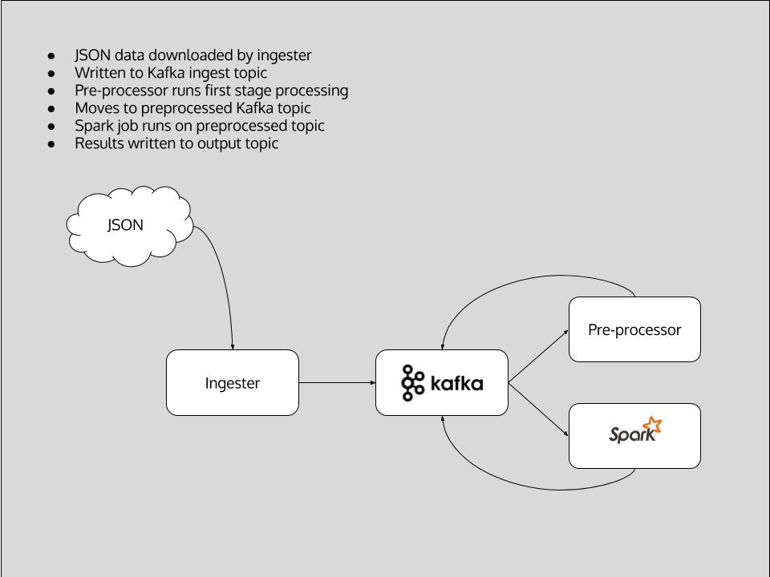
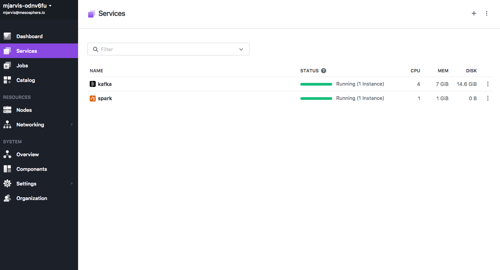
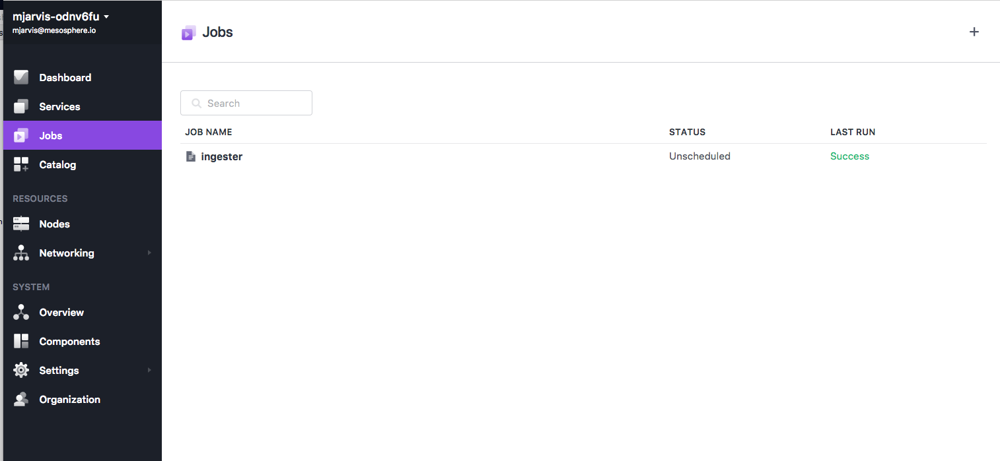
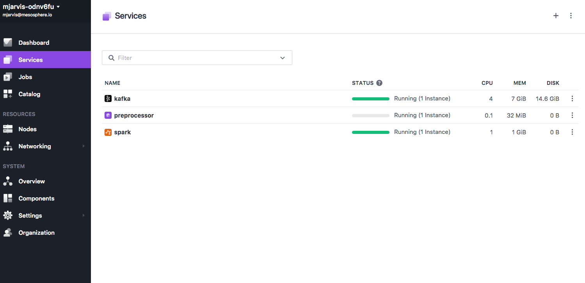
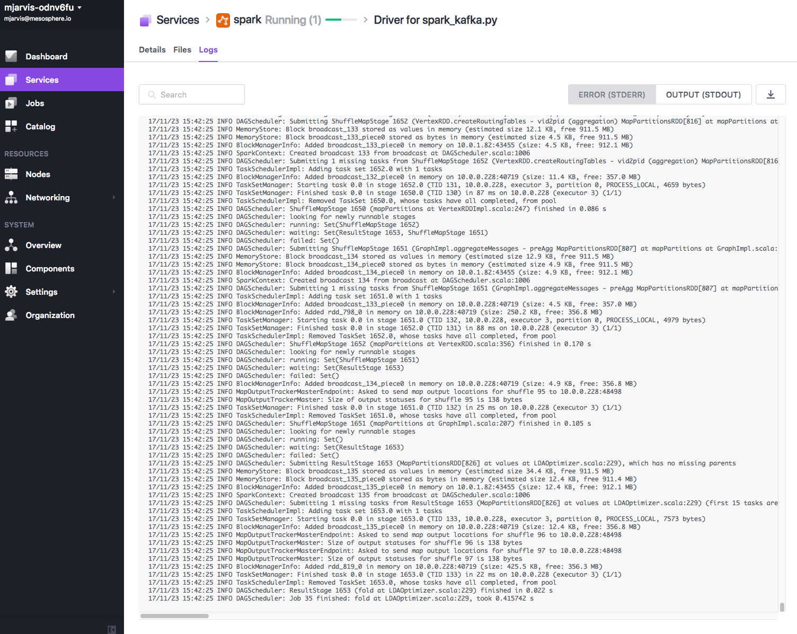

# Natural Language Processing with Apache Spark

In this demo we will use Apache Spark and Apache Kafka to setup a natural language processing pipeline.

- Estimated time for completion: 30min
 - Manual install: 15min
- Target audience: Anyone interested in language processing with Apache Spark

**Table of Contents**:

- [Architecture](#architecture)
- [Prerequisites](#prerequisites)
- [Install](#install)
- [Use the demo](#use)
 - [Generating dataset](#ingester)
 - [Pre-processing data](#preprocessor)
 - [Running Spark](#spark)
 - [Viewing output](#output)

## Architecture



This demo implements a natural language processing pipeline to perform topic inference on a data set of questions extracted from online forums, in this case StackOverflow.  

The architecture is as follows:
1. **Ingestion** - in a real world production example, this stage would be an ongoing process pulling in new data from the original source. For the purposes of the demo, we have included an example data set extracted from StackOverflow via their API. The data consists of StackOverflow questions which include a keyword set, or are tagged with the keyword set, and is in JSON format including all the metadata about each entry. In the demo, an [ingester](https://github.com/dcos/demos/blob/master/nlp/1.10/ingester/ingester.py) service downloads the data set and writes it into an initial Kafka topic.The repository also contains some [example code](https://github.com/dcos/demos/blob/master/nlp/1.10/data_creator.py) which was used to generate the JSON data by querying the StackOverflow API. In order to use this code, you need to [register](https://api.stackexchange.com/docs) on Stack Apps for an API key, and add the API key to the code. 

2. **Preprocessing** - good results in Natural Language Processing rely on cleaning and organising the initial data set before attempting to classify the dataset. In this example, we have another [microservice](https://github.com/dcos/demos/blob/master/nlp/1.10/preprocessor/preprocessor.py) which reads values from the ingest topic in Kafka and performs a number of steps to clean the data, before writing the processed text back into a different Kafka topic. The pre-processing steps are :
* Combine the two elements in the JSON that we are interested in inferring topics from - the body and the title of the question. 
* Strip out code blocks
* Strip out HTML links
* Remove newlines
* Strip any remaining HTML tags
* Remove any paths
* Remove punctuation
* Remove any strings with numbers in them
* Remove stopwords

The final step of removing stopwords is an important concept in language processing. Stop words are generally common words in a language which do not contain much linguistic information when doing automated processing, but are also domain specific - for example, in this demo we also add words which are commonly used in support scenarios such as question, problem, stuck etc. as these are unlikely to be meaningful when trying to infer the topics from questions. 

3. **Analysis** - in the final step, we define a Spark job, expressed in Python using PySpark, which takes the preprocessed text from the Kafka topic and again performs a multi-stage process against the data to classify the data into a set of inferred topics. This job uses Spark's [MLLib](https://spark.apache.org/docs/latest/ml-guide.html) machine learning library and uses : 
* [Term Frequency-Inverse Document Frequency (TF-IDF)](https://en.wikipedia.org/wiki/Tf%E2%80%93idf) to reflect how important each word is in the data set
* [Latent Dirichlet Allocation (LDA)](https://en.wikipedia.org/wiki/Latent_Dirichlet_allocation) to classify the data set into a set of topics


## Prerequisites

- A running [DC/OS 1.10](https://dcos.io/releases/) or higher cluster with at least 3 private agents and 1 public agent. Each agent should have 2 CPUs and 5 GB of RAM available. The [DC/OS CLI](https://dcos.io/docs/1.10/usage/cli/install/) also needs to be installed.
- The [dcos/demo](https://github.com/dcos/demos/) Git repo must be available locally, use: `git clone https://github.com/dcos/demos/` if you haven't done so yet.
- [SSH](https://dcos.io/docs/1.10/administration/access-node/sshcluster/) cluster access must be set up.

The DC/OS services used in the demo are as follows:

- Apache Kafka 
- Apache Spark

## Install

#### Kafka

Install the Apache Kafka package:

```bash
$ dcos package install kafka 
```

Note that if you are unfamiliar with Kafka and its terminology, you can check out the respective [101 example](https://github.com/dcos/examples/tree/master/kafka).

Next, figure out where the broker is:

```bash
$ dcos kafka endpoints broker
{
  "address": [
    "10.0.2.47:9571",
    "10.0.1.74:9903",
    "10.0.2.3:9256"
  ],
  "zookeeper": "master.mesos:2181/dcos-service-kafka",
  "dns": [
    "broker-0.kafka.mesos:9571",
    "broker-1.kafka.mesos:9903",
    "broker-2.kafka.mesos:9256"
  ],
  "vip": "broker.kafka.l4lb.thisdcos.directory:9092"
}
```

Note the FQDN for the vip, in our case `broker.kafka.l4lb.thisdcos.directory:9092`, which is independent of the actual broker locations.
It is possible to use the FQDN of any of the brokers, but using the VIP FQDN will give us load balancing.

##### Create Kafka Topics

This step is optional, since the default configuration for the Kafka package sets auto.create.topics.enable, which means Kafka automatically creates topics once you write to them. 

Creating topics is very simple using the DC/OS Kafka CLI extension. If you have installed Kafka from the UI you might have to 
install the cli extensions using `dcos package install kafka --cli'. If you installed Kafka as above using the CLI then it will automatically install the CLI extensions.

We need three Kafka topics, which we can create with:

`dcos kafka topic create ingest`

`dcos kafka topic create pre-processed`

`dcos kafka topic create spark-output`

### Spark

Our next step is to install Spark from the Catalog, and again DC/OS makes this very simple :

`dcos package install spark`

Once our services are all installed and running, the Services view should look like this :



## Use

### Ingester

We can now deploy the [ingester](https://github.com/dcos/demos/blob/master/nlp/1.10/ingester/ingester.py) to generate our initial data set. Since we are using static data in this demo, we install it as a Metronome job with this [definition](https://github.com/dcos/demos/blob/master/nlp/1.10/ingester/ingester.json). The ingester is a Python binary generated using [PyInstaller](http://www.pyinstaller.org/) which contains all its dependencies, the app defintion doesn't require a container image and is running without Docker.

`dcos job add https://raw.githubusercontent.com/dcos/demos/master/nlp/1.10/ingester/ingester.json`

Once the job is created, we can run it and load in our example data:

`dcos job run ingester`

If we now look at the Jobs tab in the UI, we should see the Job running, and once it has completed it should show a successful completion.



### Preprocessor

Now our initial data is populated in our install topic, we can deploy our [preprocessor](https://github.com/dcos/demos/blob/master/nlp/1.10/preprocessor/preprocessor.py). Once again the preprocessor is a Python binary built using PyInstaller so we can deploy it without a container image, using this [marathon app definition](https://github.com/dcos/demos/blob/master/nlp/1.10/preprocessor/preprocessor.json). The preprocessor will continue to run on any new data coming in to the ingest topic. 

`dcos marathon app add preprocessor.json`

We should then be able to see the preprocessor service in the Services tab in the UI.



### Spark

We now deploy our Spark job to classify our cleaned data into a set of inferred topics. 

The Spark [job](https://github.com/dcos/demos/blob/master/nlp/1.10/spark_kafka.py) has a number of steps:

1. Read input data from our Kafka topic and create a dataframe
2. Split our input data into arrays of strings
3. Generate a TF-IDF matrix, assigning weights for each word in order to assess how important each word is. 
4. Use Latent Dirichlet Allocation to infer a set of 20 topics from the TF-IDF matrix
i

#### PySpark configuration

In this case, we're using PySpark, which means we have some additional configuration we need to do in order to run it in a cluster.

Firstly, our PySpark jobs require some additional Python libraries. We could deploy the libraries to every node in our cluster, but this is not very scalable, so we'll deploy them along with our job using the --py-files option. This will take a zip file as its argument, and the zip file will be placed in the directory in which the job is executing. Python can treat a zip file as a directory and import modules and functions from it just like any other directory. The [zip file](https://github.com/dcos/demos/blob/master/nlp/1.10/libs.zip) contains all the required Python libraries our job needs, and in the job itself we tell Python to include these libraries in its path. 

```
import sys
import os
if os.path.exists('libs.zip'):
    sys.path.insert(0, 'libs.zip')
```

Secondly, we need to add a Spark package to allow our Spark job to read its input data from Kafka. The standalone spark-submit script has a -packages switch, which defines Maven co-ordinates for JAR's to include on the driver and executor classpaths, but the DC/OS CLI doesn't support this yet. However, we can set this in the Spark configuration directly, by defining spark.jars.package, and the DC/OS CLI provides us a mechanism for setting Spark configuration variables. 

As our job is quite resource intensive, we also need to increase the driver memory to 2048M. 

#### Running the job

Taking all that into account, our final Spark run command looks like this:

```dcos spark run --submit-args="--driver-memory 2048M --py-files=https://raw.githubusercontent.com/dcos/demos/nlp/1.10/libs.zip --conf=spark.jars.packages=org.apache.spark:spark-sql-kafka-0-10_2.11:2.2.0 https://raw.githubusercontent.com/dcos/demos/nlp/1.10/spark_kafka.py"```

The job will take a little while to run, and you can see the log output through the Logs tab for the Spark service. 



Once we see the job has finished, we can view the output in the spark-output Kafka queue. 

### Output

The output of our Spark job is a set of topics written to the spark_output queue in Kafka - these are essentially groups of words which most closely correlate to the input data. To view the output, we can use the Kafka client tools from inside a Docker container, which we will deploy using this [app definition](https://github.com/dcos/demos/blob/master/nlp/1.10/kafkaclient.json).

Firstly, deploy the container :

```dcos marathon app add kafkaclient.json```

Once the container is deployed, we can use the [task exec](https://dcos.io/docs/1.10/monitoring/debugging/task-exec/) feature to run our kafka client commands in the container and have the output streamed back to our CLI:

```
dcos task exec kafka-client bash -c "export JAVA_HOME=/opt/jdk1.8.0_144/jre/; /opt/kafka_2.12-0.11.0.0/bin/kafka-console-consumer.sh --zookeeper master.mesos:2181/dcos-service-kafka --topic spark-output --from-beginning" 
```

The output should look something like:

```
vagrant batch execute database received tomcat scaling connection scale template
docker container containers marathon external volume volumes persistent automatically variables
cassandra resources resource frameworks framework distributed information scheduler mesos particular
framework roles authentication token keeps master current registered updates files
services consul ports installation interface reason communicate checkpoint failing stack
jenkins kafka restart plugin update elasticsearch configuration value cluster topic
failed mesosdns followed group sparksubmit directory program resolve create linux
nodes chronos dashboard agents schedule master scheduled connected tasks starting
instances servers cores difference resources streaming multiple number assigned cluster
service application azure deployed deploying applications marathon discovery regions cluster
health check marathon rails project tasks hostname cloud destroy dockers
slave master slaves mesosslave zookeeper setup mesosmaster masters machine machines
access agent network images virtual default bridge mesosagent machine local
kubernetes package universe local packages environment features management google supported
install installed ubuntu build mesosphere python swarm mesos simple building
server version connect deploy endpoint wrong marathon errors figure thing
private public registry hadoop cache mongodb image monitor variable guide
spark apache executors aurora driver tasks executor cluster submit memory
marathonlb state haproxy waiting marathon deployment agent slurm ansible requests
command specify launch custom script parameters options launching definition marathon
```

This output represents a set of 20 topics which have been inferred from our dataset. In a simple example like this, it is clear that this is not an exact science, and analysis at this stage generally requires some human input, but we can see that there are some fairly clearly defined topics within our dataset:

```
kubernetes package universe local packages environment features management google supported 
```

This looks to correspond with questions about packages and package repositories. 

```
spark apache executors aurora driver tasks executor cluster submit memory
```

This looks to correspond with questions about Apache Spark configuration. 

```nodes chronos dashboard agents schedule master scheduled connected tasks starting```

This looks likely to correspond with questions about scheduling jobs on a cluster. 

In all of these cases, we might want to use this data to improve our documentation, or to focus on feature improvement. 

Whilst this demo is extremely basic, and only just scratches the surface of what is possible using natural language processing, it does show how easy it is to deploy and run these kinds of pipelines using DC/OS. In this demo, we have deployed a natural language processing pipeline which has inferred a set of topics from a dataset of mailing list questions. We have used Python based microservices, a Marathon service, and a Metronome job, together with deploying both Spark and Kafka from the DC/OS catalog.

### 

This demo was inspired by https://community.hortonworks.com/articles/84781/spark-text-analytics-uncovering-data-driven-topics.html

Should you have any questions or suggestions concerning the demo, please raise an [issue](https://jira.mesosphere.com/) in Jira or let us know via the [users@dcos.io](mailto:users@dcos.io) mailing list.
