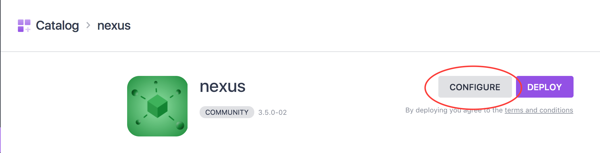
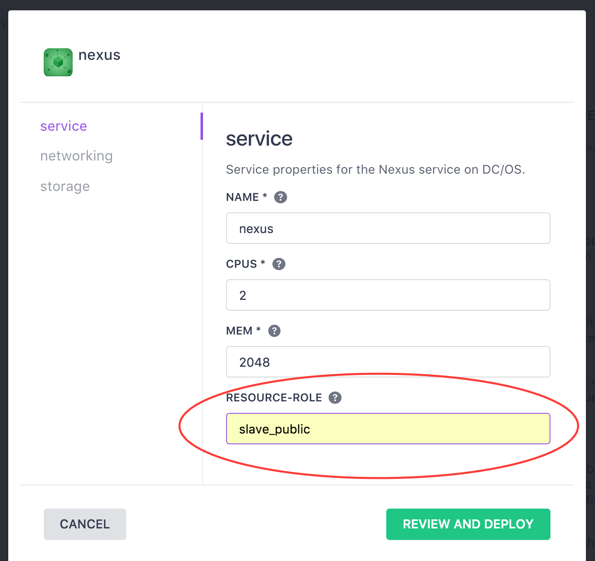
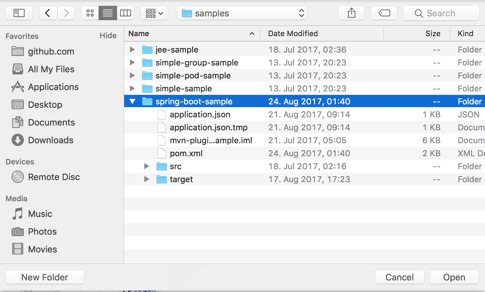
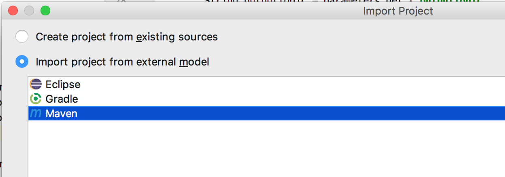
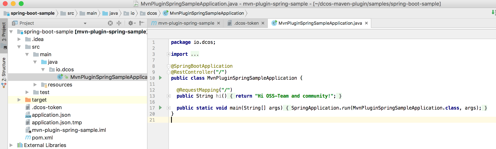
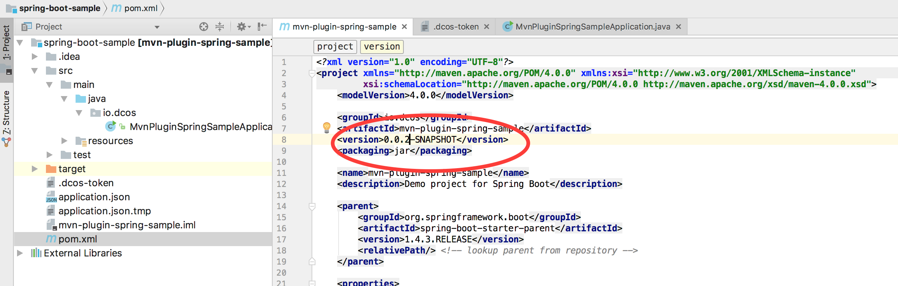

# Spring Boot Demo

This demo is all about deploying Spring Boot java applications using the [dcos-maven plugin](https://github.com/dcos-labs/dcos-maven-plugin)

- Estimated time for completion:
 - Manual install: 20min
- Target audience: Anyone interested in deploying java application on DC/OS.

**Table of Contents**:

- [Architecture](#architecture)
- [Prerequisites](#prerequisites)
- [Install](#install)
- [Use the demo](#use)


## Motivation

This demo is about how to deploy a Spring Boot demo using the [dcos-maven plugin](https://github.com/dcos-labs/dcos-maven-plugin).

Spring Boot is a great tool for developing Java based web applications profiting from the large spring ecosystem, including dependency injection, dynamically environment based configuration, Rest, security, SQL or NoSQL data stores.
The traditional options for deploying Spring Boot applications are
* starting the fat jar directly on the machine.
* wrapping the application into a docker images.

Both approaches have disadvantages:
* Deploying the jars directly requires either manual management (imagine restarts, scaling, updated) or some additional tooling.
* Using Docker images introduces some overhead (imagine creating the container image, image size, fetching the image, ...).

DC/OS offers yet another option: using the [Universal Container Runtime](https://docs.mesosphere.com/latest/deploying-services/containerizers/ucr/). Even though UCR also supports running Docker images, in this case we don't actually require a full Docker image as we have only two simple dependencies:
* a JRE runtime
* the application jar.

With UCR we can simply fetch only those two dependencies and then simply run the jar.

```
  "id": "/springboot-demo",
  "cmd": "export JAVA_HOME=`pwd`/jre && export PATH=\\\"$JAVA_HOME/bin:$PATH\\\"  && $JAVA_HOME/bin/java -jar <FILENAME>",
  "instances": 1,
  "cpus": 0.1,
  "fetch": [
    {
      "uri": "<MY_REPOSITORY>/repository/dcos/<FILENAME>",
      "extract": true,
      "executable": false,
      "cache": false
    },
    {
      "uri": "<MY JRE>",
      "extract": true,
      "executable": false,
      "cache": false
    }
  ]
  ```

In this demo we will see how the dcos-maven plugin can automate the workflow of uploading the jar file and deploying the application from within Maven (and therefore our favorite IDE).


## Prerequisites

- A running [DC/OS 1.11](https://dcos.io/releases/) or higher cluster with at least 3 private agents and 1 public agent. Each agent should have 2 CPUs and 5 GB of RAM available. The [DC/OS CLI](https://docs.mesosphere.com/latest/cli/install/) also needs to be installed.
- The [dcos-maven plugin](https://github.com/dcos-labs/dcos-maven-plugin) git repo must be available locally, use: `git clone https://github.com/dcos-labs/dcos-maven-plugin.git` if you haven't done so yet.
- [SSH](https://docs.mesosphere.com/latest/administering-clusters/sshcluster/) cluster access must be set up.
- [IntelliJ](https://www.jetbrains.com/idea/download) [configured with an JDK](https://intellij-support.jetbrains.com/hc/en-us/articles/206544879-Selecting-the-JDK-version-the-IDE-will-run-under).
- [Maven](https://maven.apache.org/download.cgi) installed.

## Setup

Before we need to setup some components:

* the artifact store to which we can upload the jar from our IDE so that DC/OS can download it.
* the IDE project in which we develop our sample project.
* the maven configuration for our cluster.

### Artifact Store

We need some artifact store which can serve the jar files. In this demo we decided to use
[Nexus](https://www.sonatype.com/nexus-repository-sonatype) as it is already available in the DC/OS package Catalog.
So we can simply use the UI to install Nexus, go to the Catalog
 we can simply use to UI and go to the Catalog and select `Nexus`.

Next, we then select Configuration

and configure Nexus to run only on the public agents, which will make it simpler to upload the jar files from our local IDE.
.

After installing Nexus, we need to retrieve the public IP address and port, so we can access the Nexus UI.
The public IPs for your public agents (recall we configured Nexus to be deployed on a public agent) can be retrieved from the [DC/OS CLI](https://docs.mesosphere.com/latest/administering-clusters/locate-public-agent/).

The port can be retrieved from the DC/OS UI.


With this information we should be able to access the Nexus UI via <publicIP>:<port> and login using the admin:admin123..


* Go to the Nexus Admin UI.


* Create a new `raw (hosted)` repository.


* Name the new repo `dcos`.


### Create IDE project

Now that we have setup Nexus, we can start up our development IDE. The dcos-maven-plugin repository you cloned as part of the prerequisites has a sample folder which includes the Spring Boot sample we will use in this demo. We use [IntelliJ](https://www.jetbrains.com/idea/) for this demo, but this should transfer to your IDE of choice.


* Create a new project from existing sources.


* Select samples/spring-boot-sample folder.


* Create a Maven project and klick through the following configuration steps.


* The created project should look similar to this:


### Configure Maven with your DC/OS cluster

Last, you need to configure the Maven project so it can access your DC/OS cluster.

* Configure the DC/OS URL and the Nexus URL (same <publicIP>:<port> you have used earlier to access the Nexus UI) in the pom.xml file as follows:
```
  <configuration>
      <dcosUrl> CLUSTER_URL </dcosUrl>
      <nexusUrl> PUBLIC_IP:PORT </nexusUrl>
      <ignoreSslCertificate>true</ignoreSslCertificate>
  </configuration>
```


* Create a .dcos-token file with your dcos token in order to enable access to the DC/OS endpoints. The token can be retrieved from the DC/OS CLI with the following command:
```
dcos config show core.dcos_acs_token
etJhbGciOiJSUzI1NiIsInR5cCI6IkpXVCJ9.eyJ1aWQiOiJib290c3RyYXB1c2VyIiwiZXhwIjoxNTA2ODY0ODEyfQ.UbhBdzZHZPErhXWLQnKT5SLqYubwK6g0we4DjfqkSOWB43gozzDtL1jutrc7zlg5ipHjtneAn4oskkYVqc-ajxN0fRbdRTaVfaLwr_wBWeHN3MEq1Lk7fEzplNQ2mc996ki2X00OkEyfAEsxmgF4JnZfpHBHBg9kOCUprLNc1vpD5y73mv5FVvFCG1QvZCtkSsFvRl23vWGErkcY05Gj5CKHHyOCWl6POBlzrrz0ubRFTpdkRMjHBWtMI6XuTOz6iSKYeySBMmY_aqH91ZlZJMuXO1XxuXBotToOm2aqYhNqlFA8yEuvnEOxbVz5Tcp2XUik3BoDiNrCee_PKjLXzcv
```


## Develop and Deploy

Now we are ready to develop and code our Spring Boot example.

* Open the io.dcos.MvnPluginSpringSampleApplication.java file.


* Build and push the artifact with `mvn clean package dcos:uploadArtifact`


* [Optional] Check in the Nexus UI that it was successfully uploaded.


* Deploy the application using `mvn clean package dcos:uploadArtifact dcos:deployUCR`.
Note, that the deployment will use the [template app-definition](https://github.com/dcos-labs/dcos-maven-plugin/blob/master/samples/spring-boot-sample/application.json) and replace `<NEXUS_URL>` and `<FILENAME>`
with the respective values. You can check from the DC/OS UI that it is deploying.


* Furthermore you can access the application using the public agent IP we used earlier: <publicIP>:8080.


* Now, we change our Spring Boot application.


* And hence also change the version of the application in the pom.xml file.


* We build, push, and deploy the new version using `mvn clean package dcos:uploadArtifact dcos:deployUCR`.
And once the deployment has finished and is healthy (i.e., the Spring Boot application has started), we can check the updated version using <publicIP>:8080.


Congratulations! You have successfully deployed and updated your Spring Boot application using the DC/OS maven plugin!

## Remarks
* In production you should use a more [advanced upgrade strategy](https://mesosphere.github.io/marathon/docs/blue-green-deploy.html) which keeps the app available during upgrades. In this demo, we decided to use a fixed port on a public agent, in order to make it simpler to access the Spring Boot application.
